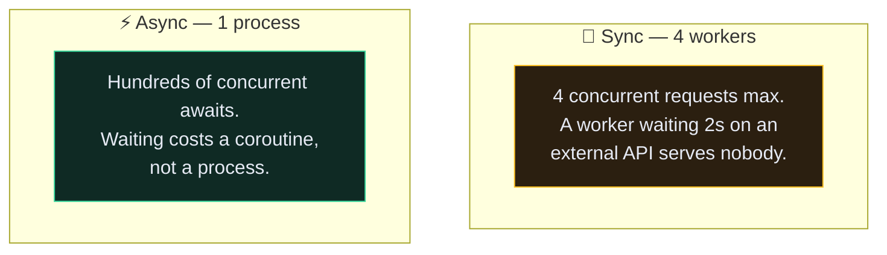

# ⚡ Async Django

> 📖 [topics/async](https://docs.djangoproject.com/en/6.1/topics/async/) · [howto/deployment/asgi](https://docs.djangoproject.com/en/6.1/howto/deployment/asgi/)

---

## 🎯 What async actually buys you

**Nothing, if your view is CPU-bound or purely database-bound.** Async wins when a request spends most of its time *waiting* — on a third-party HTTP call, on a slow client, on a websocket.



> [!TIP] Be honest about whether you need it
> The Recipe API does `SELECT`, serialize, return. That's database-bound. Async would add ASGI deployment, a second mental model, and a class of bug — for no measurable gain. **[[9.Background Jobs with Celery|Celery]] is the right answer for slow work**, not async views.
>
> Reach for async when you have websockets, server-sent events, or a view that fans out to several external APIs.

---

## 🛠️ Async views

```python
import asyncio
import httpx
from django.http import JsonResponse


async def dashboard(request):
    async with httpx.AsyncClient() as client:
        weather, news, rates = await asyncio.gather(
            client.get("https://api.weather.example/now"),
            client.get("https://api.news.example/top"),
            client.get("https://api.rates.example/usd"),
        )
    return JsonResponse({"weather": weather.json(), "news": news.json(), "rates": rates.json()})
```

Three calls in the time of the slowest, in one process. That's the case async is for.

Django runs async views under WSGI too — but in a fresh event loop per request, which throws away the benefit. **Deploy ASGI** (`uvicorn`, `daphne`, `hypercorn`) to get real concurrency.

```bash
uvicorn app.asgi:application --host 0.0.0.0 --port 9000 --workers 4
```

---

## 🗄️ The async ORM

Every queryset method has an `a`-prefixed twin:

```python
recipe = await Recipe.objects.aget(id=1)
await Recipe.objects.acreate(title="Curry", user=user)
count = await Recipe.objects.filter(user=user).acount()
exists = await Recipe.objects.filter(user=user).aexists()
await recipe.asave()
await recipe.adelete()

async for recipe in Recipe.objects.filter(user=user):
    print(recipe.title)
```

> [!CAUTION] The database driver is still synchronous
> `psycopg` is sync. Django's `a*` methods run the query in a thread pool — they give you *correct* async code, not a faster database. The win is that your event loop isn't blocked while it happens, so other coroutines proceed.

```python
# ❌ SynchronousOnlyOperation
async def view(request):
    recipes = Recipe.objects.filter(user=request.user)
    return JsonResponse({"n": len(recipes)})     # implicit sync query

# ✅
async def view(request):
    n = await Recipe.objects.filter(user=request.user).acount()
    return JsonResponse({"n": n})
```

Lazy evaluation is the trap: building a QuerySet is fine, **evaluating** it isn't. Any accidental iteration, `len()`, or `bool()` raises `SynchronousOnlyOperation`.

The same applies to deferred fields and unfetched relations — accessing them from async code raises rather than lazily loading. That interacts directly with [[4.QuerySets in Depth|`fetch_mode`]]: prefetch explicitly, or you'll hit it.

---

## 🌉 Crossing the boundary

```python
from asgiref.sync import sync_to_async, async_to_sync

# sync function, called from async code
result = await sync_to_async(some_sync_function)(arg)

# async function, called from sync code
result = async_to_sync(some_async_function)(arg)
```

`sync_to_async` defaults to `thread_sensitive=True`, meaning it runs everything in the **same** thread to keep Django's thread-local state (database connections, transactions) coherent. That serialises your calls. `thread_sensitive=False` gives real parallelism but must not touch the ORM.

---

## 🔌 DRF and async

**DRF is still synchronous.** As of now there are no async `APIView`s, serializers or permissions. An async Django view sits *outside* DRF entirely.

Practical consequences:

- You can run DRF under ASGI — Django wraps sync views in a thread. It works, and it's a common deployment.
- You cannot write `async def list(self, request)` in a `ModelViewSet`.
- If one endpoint genuinely needs async, write it as a plain Django async view alongside your DRF routes.

```python
# app/app/urls.py
urlpatterns = [
    path("api/recipe/", include("recipe.urls")),      # DRF, sync
    path("api/dashboard/", dashboard),                # plain async view
]
```

---

## ⚙️ Async middleware

```python
from asgiref.sync import iscoroutinefunction, markcoroutinefunction


class MyMiddleware:
    async_capable = True
    sync_capable = True

    def __init__(self, get_response):
        self.get_response = get_response
        if iscoroutinefunction(self.get_response):
            markcoroutinefunction(self)

    async def __call__(self, request):
        ...
```

> [!WARNING] One sync-only middleware taxes the whole stack
> Django adapts between sync and async at each boundary. A sync-only middleware in the middle of an async chain forces a thread hop **for every request** — you keep correctness and lose most of the concurrency you deployed ASGI for. Check every third-party middleware before going async.

---

## ⚠️ Gotchas

- **`SynchronousOnlyOperation`** → a QuerySet got evaluated in async code. Use `a*` methods or `sync_to_async`.
- **Async view is no faster** → you're on WSGI, or the work was never I/O-bound.
- **Connections leak / "too many clients"** → `sync_to_async(..., thread_sensitive=False)` touching the ORM.
- **`async for` on an unprefetched relation** → raises rather than lazily loading.
- **Tests fail under async** → use `TransactionTestCase` or `django.test.AsyncClient`.

---

## 🧠 Check yourself

> [!QUESTION]
> 1. Why doesn't async speed up a purely database-bound endpoint?
> 2. Why does `sync_to_async` default to `thread_sensitive=True`?
> 3. Why is Celery the better answer than async for "send an email after creating a recipe"?

---

## 🔗 Related

- [[9.Background Jobs with Celery]] · [[3.Middleware]]
- [[4.QuerySets in Depth]] · [[2.uWSGI and the Production Dockerfile]]
- [[0.Django Core Index]]
