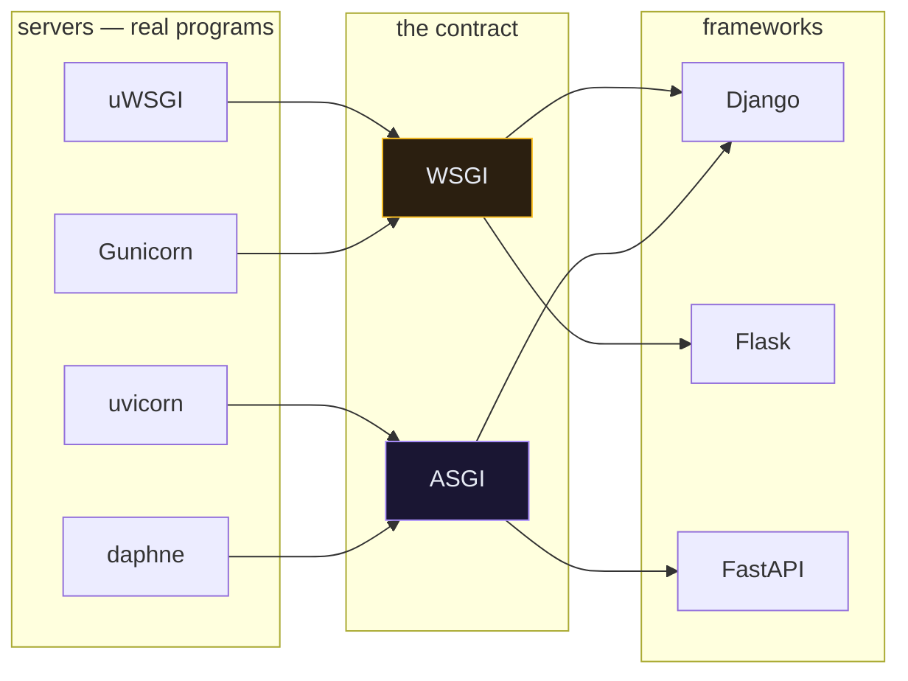
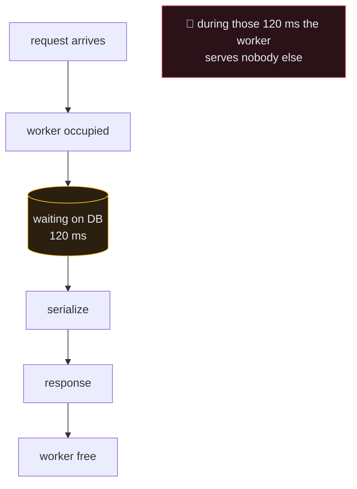
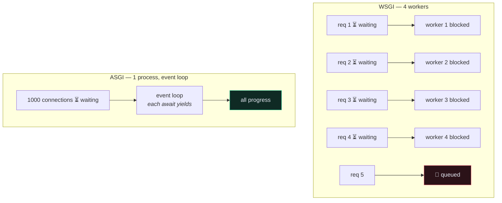
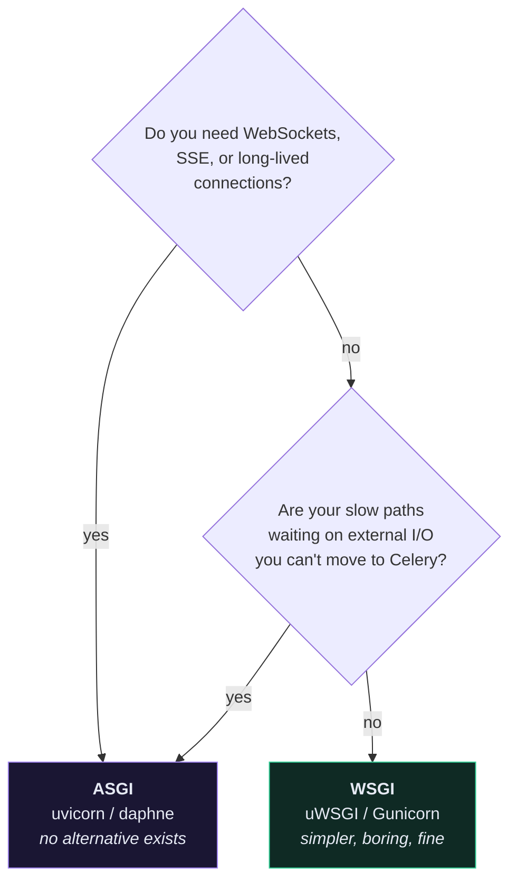

# 🔌 WSGI and ASGI

> 📖 [PEP 3333 (WSGI)](https://peps.python.org/pep-3333/) · [ASGI spec](https://asgi.readthedocs.io/) · [howto/deployment](https://docs.djangoproject.com/en/6.1/howto/deployment/)
>
> Every Django project has both `wsgi.py` and `asgi.py` and most people never learn why. Here's why.

---

## 🎯 They are contracts, not servers

This is the sentence that unlocks everything else:

> **WSGI and ASGI are *specifications* describing how a web server talks to a Python application.**

They are not programs. You cannot install WSGI. They're a document saying *"a Python web app is a callable with this exact shape, and a server may call it like this."*

That agreement is why you can swap Gunicorn for uWSGI without touching Django, and swap Django for Flask without touching your server config.



---

## 📜 WSGI — one request, one thread, start to finish

The whole specification is essentially one function signature:

```python
def application(environ, start_response):
    """environ: a dict of request data. start_response: a callable you invoke
    with the status and headers. Return an iterable of bytes."""
    start_response("200 OK", [("Content-Type", "text/plain")])
    return [b"Hello"]
```

Django's version lives in your project folder and you have almost certainly never opened it:

```python
# app/wsgi.py
import os
from django.core.wsgi import get_wsgi_application

os.environ.setdefault("DJANGO_SETTINGS_MODULE", "app.settings")

application = get_wsgi_application()
```

That `application` object is what `uwsgi --module app.wsgi` imports and calls.

### The shape of the limitation

A WSGI call is **synchronous and blocking by definition**. The server hands you a request, your function runs to completion, you return a response. There is no vocabulary in the contract for:

- "I'm waiting on the database, use this worker for someone else"
- "keep this connection open, I'll send more later"
- "the client just sent me another message on the same connection"



That's why WSGI deployment scales with **processes and threads**: four workers = four simultaneous requests. Waiting costs you a whole worker.

> [!CAUTION] WSGI cannot do WebSockets — not slowly, at all
> This is the point people miss. It isn't a performance limitation you can throw hardware at. The protocol has **no way to represent a connection that stays open and exchanges many messages**. `start_response` is called once; you return a body; the exchange is over.
>
> Real-time chat, live notifications, collaborative editing — none are possible under WSGI. That, more than speed, is why ASGI exists.

---

## ⚡ ASGI — an event stream, not a return value

ASGI replaces "return a response" with "send and receive events":

```python
async def application(scope, receive, send):
    """scope: metadata about this connection (type, path, headers).
    receive: await it to get the next incoming event.
    send: await it to push an outgoing event."""
    await send({"type": "http.response.start", "status": 200,
                "headers": [(b"content-type", b"text/plain")]})
    await send({"type": "http.response.body", "body": b"Hello"})
```

```python
# app/asgi.py
import os
from django.core.asgi import get_asgi_application

os.environ.setdefault("DJANGO_SETTINGS_MODULE", "app.settings")

application = get_asgi_application()
```

Three consequences fall out of that shape:

| | Because… |
| --- | --- |
| **WebSockets work** | `scope["type"]` can be `"websocket"`, and you may `receive()` many times |
| **Streaming works** | you can `send` body chunks over time — SSE, long downloads |
| **Waiting is cheap** | `await` yields control, so one process handles thousands of *waiting* connections |



---

## 📊 Side by side

| | **WSGI** | **ASGI** |
| --- | --- | --- |
| Year | 2003 (PEP 333) / 2010 (3333) | 2018 |
| Signature | `app(environ, start_response)` | `async app(scope, receive, send)` |
| Model | one request → one response | event stream |
| WebSockets | ❌ impossible | ✅ |
| Server-Sent Events / streaming | ⚠️ awkward | ✅ |
| HTTP/2, HTTP/3 | via the proxy only | ✅ |
| Background tasks in-process | ❌ | ✅ *(still prefer [[9.Background Jobs with Celery\|Celery]])* |
| Concurrency comes from | processes + threads | the event loop |
| Servers | uWSGI, Gunicorn, mod_wsgi | uvicorn, daphne, hypercorn |
| Django file | `app/wsgi.py` | `app/asgi.py` |
| Django support | since forever | since 3.0 |

---

## 🤔 So which do I deploy?



**For the Recipe API — and most CRUD APIs — WSGI is the right answer.** The work is `SELECT`, serialize, return. That's database-bound, and the database is on the same network. ASGI would add a deployment model, a second mental model for every view, and a class of bug, for no measurable gain.

> [!TIP] "Async" is not a synonym for "fast"
> Async helps when your process spends its time **waiting on something else** — a slow third-party API, thousands of idle open sockets. It does nothing for CPU work, and nothing for a query that's slow because it's missing an index.
>
> If your endpoint is slow, the fix is almost always [[4.The N+1 Problem|fewer queries]], an index, or [[9.Background Jobs with Celery|moving the work off the request]] — not a different protocol.

---

## 🔀 The four combinations

You can mix sync/async views with either deployment, and only one combination is actively pointless:

| View | Deployment | Result |
| --- | --- | --- |
| sync | WSGI | ✅ classic Django. What this project does. |
| sync | ASGI | ✅ fine — Django runs it in a thread pool. Common when part of the app needs WebSockets. |
| async | ASGI | ✅ the real win |
| async | **WSGI** | ⚠️ **works, but pointless** — Django spins up a fresh event loop per request and tears it down, so you pay the complexity and get none of the concurrency |

That last row catches people who add `async def` to a view, see no improvement, and conclude async is overrated.

---

## 🛠️ Running each

```bash
uwsgi --socket :9000 --workers 4 --master --enable-threads --module app.wsgi
```

```bash
gunicorn app.wsgi:application --workers 4 --bind 0.0.0.0:9000
```

```bash
uvicorn app.asgi:application --host 0.0.0.0 --port 9000 --workers 4
```

```bash
gunicorn app.asgi:application -k uvicorn.workers.UvicornWorker --workers 4
```

That last one is a common production shape: Gunicorn's mature process supervision, uvicorn's ASGI implementation.

> [!WARNING] `--workers` means different things
> Under WSGI, workers **are** your concurrency limit — 4 workers, 4 simultaneous requests.
> Under ASGI, each worker runs an event loop handling many connections, so workers are about using multiple CPU cores, not about connection count.

---

## ⚠️ Gotchas

- **`SynchronousOnlyOperation`** → you touched the ORM from async code without `sync_to_async`. Django refuses rather than corrupt connection state. See [[10.Async Django]].
- **Async view is no faster** → you're on WSGI, or the work was never I/O-bound.
- **WebSockets 404 under uvicorn** → plain `get_asgi_application()` only handles HTTP. WebSockets need [Django Channels](https://channels.readthedocs.io/) routing in `asgi.py`.
- **One sync-only middleware kills async performance** → Django adapts at each boundary, so a sync middleware in an async chain forces a thread hop **per request**. Audit third-party middleware before switching.
- **nginx config differs** → `uwsgi_pass` speaks the binary uwsgi protocol; uvicorn and Gunicorn speak HTTP, so you want `proxy_pass`. WebSockets additionally need the `Upgrade` and `Connection` headers forwarded. See [[3.nginx as a Reverse Proxy]].

---

## 🧠 Check yourself

> [!QUESTION]
> 1. Why is "WSGI can't do WebSockets" a statement about the *protocol* rather than about speed?
> 2. You add `async def` to a view and deploy under uWSGI. What actually happens?
> 3. Under WSGI, why does a 120 ms database query cost you a whole worker?

---

## 🔗 Related

- [[10.Async Django]] — writing async views, and when not to
- [[2.uWSGI and the Production Dockerfile]] · [[3.nginx as a Reverse Proxy]]
- [[15.App Anatomy — Every File and What Belongs In It]]
- [[0.Django Core Index]]
