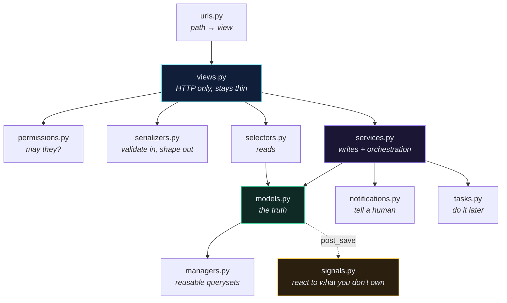
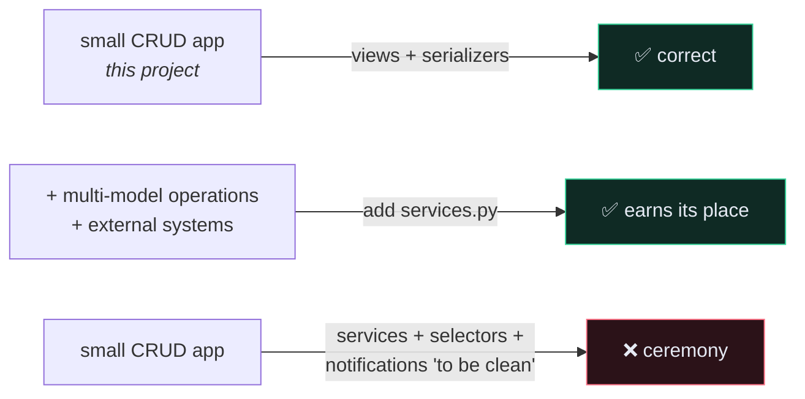

# 🗂️ App Anatomy — Every File and What Belongs In It

> You open a real Django codebase and find `services.py`, `selectors.py`, `notifications.py`, `tasks.py`, `managers.py`. None of them were in the tutorial. Where did they come from, and which do you actually need?

---

## 🎯 The thing nobody tells you

**`startapp` creates six files. Most of the rest are community conventions, not framework features.**

That single fact explains the confusion. Tutorials present one team's file layout as though it were Django canon, different tutorials present different layouts, and nothing errors when you pick differently — so you never find out which choices were real.

So the first question about any Django file is: **is this name load-bearing, or is it just a module someone imports?**

| Django genuinely looks for these | Nothing special — just a module |
| --- | --- |
| `models.py` — app loading, migrations | `services.py` |
| `admin.py` — autodiscovered | `selectors.py` |
| `apps.py` — app config | `notifications.py` |
| `tests.py` / `tests/` — test runner | `permissions.py` |
| `migrations/` — migration state | `filters.py` |
| `management/commands/*.py` — CLI | `validators.py` |
| `tasks.py` — **Celery's** `autodiscover_tasks()` | `constants.py` · `enums.py` |
| `urls.py` — only because *you* `include()` it | `utils.py` |

> [!TIP] The test
> Rename `admin.py` to `admin_stuff.py` and your admin silently disappears — the name was load-bearing.
> Rename `services.py` to `business.py`, fix your imports, and **nothing else changes** — that name was never magic.

---

## 📦 What `startapp` actually gives you

```bash
docker compose run --rm app sh -c "python manage.py startapp recipe"
```

```text
recipe/
├── __init__.py
├── admin.py          registers models in /admin
├── apps.py           app config — and where signals get wired
├── models.py         your tables
├── tests.py          delete this; make a tests/ package instead
├── views.py          request → response
└── migrations/
    └── __init__.py
```

**Not created, though you'll need them immediately:** `urls.py` and `serializers.py`.

---

## 🧭 The map



---

## 📁 The files, one by one

### `signals.py` — react to something you don't own

Receivers for `post_save`, `post_delete`, `m2m_changed`. Covered fully in [[7.Signals]]; the file-level facts:

```python
# recipe/apps.py
class RecipeConfig(AppConfig):
    name = "recipe"

    def ready(self):
        import recipe.signals      # noqa: F401
```

> [!WARNING] The import in `ready()` is the entire wiring
> A `signals.py` nobody imports is a file of dead code. Django will not find it for you. And flake8 will flag the import as unused — hence `# noqa: F401`. Delete that "unused" import for tidiness and your signals stop firing, silently, with no error anywhere.

**Use it when you don't own the sender** — you can't edit `django.contrib.auth`'s `User.save()`, but you can listen to it. **If you own the code that fires the event, just call the function**; a signal makes that call invisible to anyone reading the caller.

---

### `services.py` — business logic that isn't one model's job

This is the file people find most confusing, because Django has no opinion about it.

**The problem it solves:** where does an operation live when it touches several models, calls an external system, and must be callable from more than one place?

```python
# recipe/services.py
from django.db import transaction

from core.models import Recipe, Tag
from recipe import notifications


@transaction.atomic
def publish_recipe(*, recipe: Recipe, user: User) -> Recipe:
    """Publish a recipe: validate ownership, flip state, notify followers."""
    if recipe.user_id != user.id:
        raise PermissionError("Not your recipe.")

    if not recipe.tags.exists():
        raise ValidationError("A published recipe needs at least one tag.")

    recipe.is_published = True
    recipe.published_at = timezone.now()
    recipe.save(update_fields=["is_published", "published_at"])

    transaction.on_commit(
        lambda: notifications.notify_followers_of_new_recipe(recipe=recipe)
    )

    return recipe
```

Now the **same** operation is callable from an API view, a management command, an admin action and a Celery task — and the rules live in exactly one place.

```python
# recipe/views.py — the view shrinks to HTTP concerns
@action(methods=["POST"], detail=True)
def publish(self, request, pk=None):
    recipe = self.get_object()
    services.publish_recipe(recipe=recipe, user=request.user)
    return Response(self.get_serializer(recipe).data)
```

**Conventions worth copying** (from the widely-used [HackSoft Django Styleguide](https://github.com/HackSoftware/Django-Styleguide)):

- **Keyword-only arguments** — that `*` in the signature. `publish_recipe(recipe, user)` is easy to get backwards; `publish_recipe(recipe=…, user=…)` isn't.
- **Verb names** — `publish_recipe`, not `RecipeService.handle()`.
- **Plain functions, not classes.** A class with no state is a namespace with extra syntax.

> [!CAUTION] Don't create `services.py` before you need it
> A service that wraps `Recipe.objects.create(**data)` is pure ceremony — you've added a file, an import and a layer to reach the thing you could have called directly.
>
> **The trigger is a second entry point, or a second model.** Until then, [[Serializers|`serializers.py`]] doing validation and `create()` is the correct Django/DRF answer, and this whole project is built that way.

---

### `selectors.py` — the read half

The symmetric partner to services: services **write**, selectors **read**.

```python
# recipe/selectors.py
def get_published_recipes_for_feed(*, user: User, limit: int = 20):
    return (
        Recipe.objects
        .filter(is_published=True)
        .exclude(user=user)
        .select_related("user")
        .prefetch_related("tags")
        .order_by("-published_at")[:limit]
    )
```

Worth having when a query is non-trivial **and used in more than one place**. A single `get_queryset()` in one viewset does not need extracting.

---

### `managers.py` — reusable querysets on the model

Different from selectors: a manager is **attached to the model** and chains.

```python
# core/managers.py
class RecipeQuerySet(models.QuerySet):
    def published(self):
        return self.filter(is_published=True)

    def for_user(self, user):
        return self.filter(user=user)


class RecipeManager(models.Manager.from_queryset(RecipeQuerySet)):
    pass
```

```python
class Recipe(models.Model):
    objects = RecipeManager()
```

```python
Recipe.objects.published().for_user(request.user)      # chains, reads well
```

**Manager or selector?** If it's a filter on *one* model and you want it chainable → manager. If it joins several models or takes non-model arguments → selector.

---

### `notifications.py` — telling humans things

```python
# recipe/notifications.py
def notify_followers_of_new_recipe(*, recipe: Recipe) -> None:
    emails = list(recipe.user.followers.values_list("email", flat=True))

    if not emails:
        return

    send_mail(
        subject=f"{recipe.user.name} published {recipe.title}",
        message="…",
        from_email="noreply@example.com",
        recipient_list=emails,
        using="notifications",          # Django 6.1 MAILERS alias
    )
```

**Why separate it from `services.py`?** Because *deciding* to notify and *how* to notify are different concerns, and they change for different reasons. Swapping email for push touches one file. And in tests you mock one module instead of hunting `send_mail` calls across the codebase.

Often this file is a thin dispatcher that hands off to [[9.Background Jobs with Celery|`tasks.py`]] — sending mail inside a request is exactly the blocking work you want off the request path.

---

### `tasks.py` — the one arbitrary-looking name that *is* load-bearing

```python
# recipe/tasks.py
@shared_task
def generate_recipe_pdf(recipe_id: int) -> None:
    ...
```

> [!WARNING] The filename is not a convention here
> `app.autodiscover_tasks()` looks for a module named **exactly `tasks.py`** in each installed app. Name it `jobs.py` and you get `Received unregistered task` at runtime, with nothing at import time to warn you.

---

### The rest, briefly

| File | Holds | Load-bearing? |
| --- | --- | --- |
| `urls.py` | `urlpatterns`, router registration, `app_name` | ❌ but universal |
| `serializers.py` | DRF serializers | ❌ but universal |
| `permissions.py` | `BasePermission` subclasses — see [[5.Custom Permissions]] | ❌ |
| `filters.py` | `django-filter` FilterSets | ❌ |
| `validators.py` | reusable field validators | ❌ |
| `constants.py` / `enums.py` | `TextChoices`, magic numbers | ❌ |
| `exceptions.py` | custom `APIException` subclasses | ❌ |
| `middleware.py` | see [[3.Middleware]] | ❌ |
| `apps.py` | `AppConfig`, `ready()` | ✅ |
| `management/commands/x.py` | `python manage.py x` — see [[12.Management Commands]] | ✅ **both `__init__.py` required** |

> [!CAUTION] `utils.py` is where architecture goes to die
> Every mature codebase has a 900-line `utils.py` nobody dares touch, because "utils" describes where code *isn't* rather than what it *is*. If a function is about notifications it belongs in `notifications.py`; if it's about recipes it belongs with recipes. Reach for `utils.py` only for genuinely generic helpers — string formatting, date maths — that have nothing to do with your domain.

---

## 🧭 Where does this logic go?

| The logic is… | Put it in |
| --- | --- |
| the shape of the data, or a constraint that must always hold | `models.py` (+ `constraints`) |
| checking incoming data is well-formed | `serializers.py` |
| deciding whether this user may act | `permissions.py` |
| mapping HTTP to an operation | `views.py` |
| a reusable filter on one model | `managers.py` |
| a multi-model or external-system operation | `services.py` |
| a non-trivial read used in several places | `selectors.py` |
| sending something to a person | `notifications.py` |
| slow, external, or retryable | `tasks.py` |
| reacting to a model you don't control | `signals.py` |
| runs before/after every request | `middleware.py` |
| triggered from a terminal or cron | `management/commands/` |

---

## 🎯 How many of these does *this* project need?

**Almost none of them — and that's the honest answer.**

The Recipe API is CRUD over four models. Its logic fits in serializers and viewsets, which is precisely where Django and DRF intend it to go. Adding `services.py`, `selectors.py` and `notifications.py` to an app with twelve lines of business logic makes it *harder* to read, not easier — you've traded one file you can hold in your head for four you have to navigate.



**Add a file when a specific pain appears**, not because a styleguide lists it:

| Pain you actually feel | File that fixes it |
| --- | --- |
| "I need this operation from both the API and a cron job" | `services.py` |
| "This 12-line queryset is copy-pasted in three viewsets" | `managers.py` or `selectors.py` |
| "This request takes four seconds because it sends email" | `tasks.py` |
| "I can't hook `User.save()` because I don't own it" | `signals.py` |
| "Every view repeats the same ownership check" | `permissions.py` |

---

## ⚠️ Gotchas

- **`signals.py` never runs** → not imported in `AppConfig.ready()`, or the "unused" import was deleted.
- **`Received unregistered task`** → the file isn't named `tasks.py`.
- **`Unknown command`** → a missing `__init__.py` under `management/` or `management/commands/`.
- **Circular imports between `services.py` and `models.py`** → move the import inside the function, or make the service take model instances as arguments instead of importing them to fetch.
- **A service that only calls `Model.objects.create()`** → delete the service.
- **Business rules in three places** → the actual failure mode this whole page is about. Pick one home per rule and mean it.

---

## 🧠 Check yourself

> [!QUESTION]
> 1. What's the difference between `admin.py` and `services.py`, in terms of how Django treats the filename?
> 2. Why does `tasks.py` have to be called `tasks.py`, when `services.py` can be called anything?
> 3. This project has no `services.py`. Is that a gap, and what would have to change for it to become one?

---

## 🔗 Related

- [[Django Project Structure]] — project vs app, the five original files
- [[7.Signals]] · [[9.Background Jobs with Celery]] · [[12.Management Commands]]
- [[14.WSGI and ASGI]] — the other two files in your project folder
- [[0.Django Core Index]]
