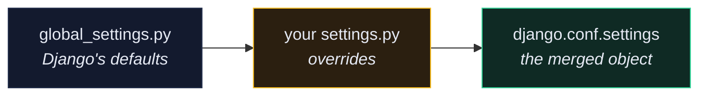

# ⚙️ Settings and Configuration

> 📖 [ref/settings](https://docs.djangoproject.com/en/6.1/ref/settings/) · [topics/settings](https://docs.djangoproject.com/en/6.1/topics/settings/)

---

## 🎯 How settings actually load

`settings.py` is just a Python module. Django finds it through the `DJANGO_SETTINGS_MODULE` environment variable, which `manage.py` sets for you:

```python
# manage.py
os.environ.setdefault("DJANGO_SETTINGS_MODULE", "app.settings")
```



Anything you don't define falls back to Django's global default. `settings.py` is a **diff**, not a complete configuration — which is why a 40-line settings file is a working Django project.

**Always import it lazily:**

```python
from django.conf import settings          # ✅ the merged, live object
import app.settings as settings           # ❌ raw module, no defaults, no overrides
```

---

## 🔑 The settings that matter in this project

| Setting | Why |
| --- | --- |
| `SECRET_KEY` | signs sessions, password-reset tokens, signed cookies |
| `DEBUG` | `True` leaks your settings and env on any 500 |
| `ALLOWED_HOSTS` | with `DEBUG=False`, anything not listed gets `400` |
| `INSTALLED_APPS` | an app does **nothing** until it's here |
| `AUTH_USER_MODEL` | must be set before the first `migrate` |
| `DATABASES` | engine, host, credentials |
| `MIDDLEWARE` | order-sensitive — see [[3.Middleware]] |
| `REST_FRAMEWORK` | DRF's own dict: auth, permissions, pagination, throttling |
| `STATIC_ROOT` / `MEDIA_ROOT` | where `collectstatic` writes and uploads land |
| `MAILERS` | 6.1's replacement for `EMAIL_*` — see [[11.Email and Mailers]] |

---

## 🌍 Per-environment settings

Three patterns, in increasing order of scale.

### 1. One file, environment variables *(what this project uses)*

```python
import os

SECRET_KEY = os.environ.get("SECRET_KEY", "changeme")
DEBUG = bool(int(os.environ.get("DEBUG", 0)))

ALLOWED_HOSTS = []
ALLOWED_HOSTS.extend(filter(None, os.environ.get("ALLOWED_HOSTS", "").split(",")))
```

Simple, twelve-factor, and the whole config surface is visible in one file. See [[4.Environment Variables and Secrets]].

### 2. A settings package

```text
app/settings/
├── __init__.py
├── base.py
├── dev.py         # from .base import *
├── prod.py
└── test.py
```

```bash
DJANGO_SETTINGS_MODULE=app.settings.prod
```

Worth it once dev and prod differ structurally (different `INSTALLED_APPS`, different middleware), not merely by values.

### 3. `django-environ` / `pydantic-settings`

Typed parsing and a fail-fast error when a required variable is missing:

```python
import environ

env = environ.Env(DEBUG=(bool, False))
DEBUG = env("DEBUG")
DATABASES = {"default": env.db()}      # parses DATABASE_URL
```

> [!TIP] Fail loudly on missing config
> The `os.environ.get("SECRET_KEY", "changeme")` default is convenient in dev and dangerous in prod — a typo in your `.env` silently ships a known key. Guard it:
> ```python
> if not DEBUG and SECRET_KEY == "changeme":
>     raise ImproperlyConfigured("SECRET_KEY must be set in production.")
> ```

---

## 🧪 Overriding settings in tests

```python
from django.test import TestCase, override_settings


@override_settings(CACHES={"default": {"BACKEND": "django.core.cache.backends.dummy.DummyCache"}})
class ThrottleTests(TestCase):
    ...


class SomeTests(TestCase):
    @override_settings(DEBUG=True)
    def test_something(self):
        ...

    def test_inline(self):
        with self.settings(MEDIA_ROOT="/tmp/test-media"):
            ...
```

> [!WARNING] `@override_settings` doesn't reach everything
> Settings read **at import time** are already baked in. `MIDDLEWARE`, `INSTALLED_APPS` and `DATABASES` are the usual offenders — overriding them per-test often does nothing, silently. Use a dedicated test settings module for those.

---

## 🔍 Inspecting settings

```bash
docker compose run --rm app sh -c "python manage.py diffsettings"
```

Shows only what you changed from Django's defaults — the fastest way to audit a settings file you didn't write.

```bash
docker compose run --rm app sh -c "python manage.py check --deploy"
```

Audits security-relevant settings. Every warning is something that has been exploited in a real Django app. See [[6.Post-Deploy Checklist]].

---

## ⚠️ Gotchas

- **`ImproperlyConfigured: Requested setting X, but settings are not configured`** → you imported something that touches settings before `django.setup()` ran. Usually a module-level import in a script.
- **Changing `AUTH_USER_MODEL` after `migrate`** → `InconsistentMigrationHistory`. Set it before the first migration, always.
- **Settings module not found in Docker** → `DJANGO_SETTINGS_MODULE` is set by `manage.py` but *not* by `uwsgi`. The production entrypoint passes `--module app.wsgi`, which sets it in `wsgi.py`.
- **Secrets in `settings.py`** → they're now in git history forever. See [[4.Environment Variables and Secrets]].

---

## 🧠 Check yourself

> [!QUESTION]
> 1. Why import `from django.conf import settings` rather than the module directly?
> 2. Why does `@override_settings(INSTALLED_APPS=[...])` often not work?
> 3. What does `diffsettings` tell you that reading `settings.py` doesn't?

---

## 🔗 Related

- [[3.Middleware]] · [[9.Security Features]]
- [[4.Environment Variables and Secrets]] · [[5.Configure settings.py for PostgreSQL]]
- [[0.Django Core Index]]
