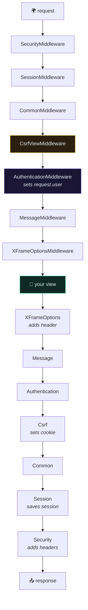

# 🧅 Middleware

> 📖 [topics/http/middleware](https://docs.djangoproject.com/en/6.1/topics/http/middleware/)

---

## 🎯 Core Concept

Middleware is a chain of wrappers around **every** request and response. Django calls it an onion, and that's exactly right: a request travels inward through each layer to the view, and the response travels back outward through the same layers **in reverse**.



**Order is the setting.** `MIDDLEWARE` is a list, and the list *is* the nesting order.

---

## 🧰 The default stack

| Middleware | Does |
| --- | --- |
| `SecurityMiddleware` | HTTPS redirect, HSTS, `nosniff`, referrer policy |
| `SessionMiddleware` | loads the session into `request.session` |
| `CommonMiddleware` | `APPEND_SLASH`, `PREPEND_WWW`, `DISALLOWED_USER_AGENTS` |
| `CsrfViewMiddleware` | validates the CSRF token on unsafe methods |
| `AuthenticationMiddleware` | **sets `request.user`** from the session |
| `MessageMiddleware` | the flash-messages framework |
| `XFrameOptionsMiddleware` | `X-Frame-Options` — clickjacking |

> [!WARNING] `AuthenticationMiddleware` must come after `SessionMiddleware`
> It reads the user id *out of* the session. Put it first and `request.user` is always anonymous, with no error to tell you why. Several of the default entries have ordering dependencies like this.

> [!INFO] DRF does not use `request.user` from middleware
> `AuthenticationMiddleware` sets `request.user` from the **session**. DRF's `TokenAuthentication` sets it again, later, from the `Authorization` header — inside `APIView.dispatch()`. That's why a DRF endpoint works fine for a client that has no session cookie at all. See [[Token Authentication]].

---

## 🛠️ Writing one

```python
# app/core/middleware.py
class SimpleMiddleware:
    def __init__(self, get_response):
        self.get_response = get_response       # called ONCE at startup

    def __call__(self, request):
        # --- before the view ---
        response = self.get_response(request)
        # --- after the view ---
        return response
```

Or as a function:

```python
def simple_middleware(get_response):
    def middleware(request):
        response = get_response(request)
        return response
    return middleware
```

```python
MIDDLEWARE = [
    "core.middleware.SimpleMiddleware",
    ...
]
```

**Short-circuiting:** return a response *without* calling `get_response()` and the view never runs. The response then travels back out through only the layers it already passed. That's how a maintenance-mode or IP-allowlist middleware works.

---

## 🪝 The extra hooks

Beyond `__call__`, a middleware may define:

| Hook | When | Return |
| --- | --- | --- |
| `process_view(request, view_func, view_args, view_kwargs)` | just before the view | `None` to continue, or an `HttpResponse` to short-circuit |
| `process_exception(request, exception)` | the view raised | `None` or an `HttpResponse` |
| `process_template_response(request, response)` | response has `.render()` | a response with `.render()` |

`process_exception` and `process_template_response` run **in reverse order**, like the response phase.

> [!CAUTION] `process_exception` only catches view exceptions
> An exception raised in another middleware does not reach it. And DRF handles its own exceptions inside `dispatch()`, so a DRF `ValidationError` never becomes a middleware exception at all — it's already a `400` by the time middleware sees the response.

---

## 🧵 The request-ID middleware

The single most useful custom middleware for a production API — it makes logs traceable per request:

```python
# app/core/middleware.py
import uuid
from contextvars import ContextVar

request_id_var: ContextVar[str] = ContextVar("request_id", default="-")


class RequestIDMiddleware:
    def __init__(self, get_response):
        self.get_response = get_response

    def __call__(self, request):
        rid = request.headers.get("X-Request-ID") or uuid.uuid4().hex[:12]
        request_id_var.set(rid)
        request.request_id = rid

        response = self.get_response(request)
        response["X-Request-ID"] = rid
        return response
```

Put it **first** in `MIDDLEWARE` so every later layer's logs carry the id. Full treatment in [[11.Logging and Observability]].

---

## ⚡ Sync, async, or both

```python
from asgiref.sync import iscoroutinefunction, markcoroutinefunction


class FlexibleMiddleware:
    async_capable = True
    sync_capable = True

    def __init__(self, get_response):
        self.get_response = get_response
        if iscoroutinefunction(self.get_response):
            markcoroutinefunction(self)
```

Declare only what you support. A sync-only middleware in an async stack forces Django to wrap it in a thread on every request — correct, but it quietly costs you the concurrency you deployed ASGI for. See [[10.Async Django]].

---

## ⚠️ Gotchas

- **`request.user` is always `AnonymousUser`** → `AuthenticationMiddleware` missing, or above `SessionMiddleware`.
- **`403 CSRF Failed` from a non-browser client** → `CsrfViewMiddleware` plus DRF's `SessionAuthentication`. Use token auth. See [[SessionAuthentication]].
- **`MiddlewareNotUsed` raised in `__init__`** → intentional; Django removes it from the chain at startup. Useful for dev-only middleware.
- **Reading `request.POST` in `process_view`** → freezes the upload handlers; file uploads break.
- **Middleware runs on static files too** in dev — a slow middleware makes the whole dev server feel broken.
- **`__init__` runs once, not per request** → don't store per-request state on `self`. Use a `ContextVar`, as above.

---

## 🧠 Check yourself

> [!QUESTION]
> 1. Why must `AuthenticationMiddleware` come after `SessionMiddleware`?
> 2. If a middleware returns a response without calling `get_response()`, which layers still see it?
> 3. Why doesn't a DRF `ValidationError` reach `process_exception`?

---

## 🔗 Related

- [[2.Settings and Configuration]] · [[9.Security Features]] · [[10.Async Django]]
- [[11.Logging and Observability]] · [[Token Authentication]]
- [[0.Django Core Index]]
