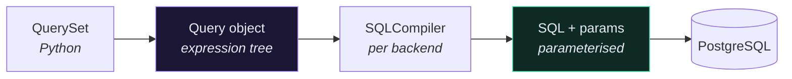

# 🔬 QuerySets in Depth

> 📖 [ref/models/querysets](https://docs.djangoproject.com/en/6.1/ref/models/querysets/) · [topics/db/optimization](https://docs.djangoproject.com/en/6.1/topics/db/optimization/)
>
> The cookbook is [[4.Django ORM Cookbook]]. This note is the **mechanism** — what a QuerySet is, and when it becomes SQL.

---

## 🎯 A QuerySet is a promise, not a result

```python
qs = Recipe.objects.filter(user=user)     # 0 queries
qs = qs.filter(price__lt=10)              # 0 queries
qs = qs.order_by("-id")                   # 0 queries
qs = qs[:10]                              # 0 queries
results = list(qs)                        # 1 query — everything at once
```

Chaining builds an expression tree. Nothing touches the database until something **forces evaluation**.

| Forces a query | Does not |
| --- | --- |
| `list(qs)` | `qs.filter(...)` |
| `for r in qs:` | `qs.exclude(...)` |
| `len(qs)` | `qs.order_by(...)` |
| `bool(qs)` / `if qs:` | `qs[5:10]` *(slicing)* |
| `qs[0]` *(indexing)* | `qs.only(...)` / `.defer(...)` |
| `repr(qs)` | assignment |

> [!TIP] `repr()` is why the shell lies to you
> Printing a QuerySet in the shell evaluates it, so laziness is invisible there. In real code the query fires wherever you first iterate — often inside a template or a serializer, far from where you built it.

---

## 💾 The result cache

```python
qs = Recipe.objects.all()
for r in qs: ...        # query 1 — result cached on the QuerySet
for r in qs: ...        # 0 queries — served from the cache

for r in Recipe.objects.all(): ...   # a NEW QuerySet — query 2
```

```python
# ❌ two queries, and the check is wasteful
if Recipe.objects.filter(user=user).exists():
    for r in Recipe.objects.filter(user=user): ...

# ✅ one query
recipes = list(Recipe.objects.filter(user=user))
if recipes:
    for r in recipes: ...
```

**`.iterator()` deliberately skips the cache** — for very large result sets where holding every row in memory is the problem:

```python
for recipe in Recipe.objects.all().iterator(chunk_size=2000):
    process(recipe)
```

Never combine `.iterator()` with re-iteration; there's nothing cached to re-read.

---

## ⭐ `fetch_mode()` — new in Django 6.1

Until 6.1 your only tools were "predict what you'll need" (`select_related` / `prefetch_related`). Now Django can react to what you actually access.

```python
from django.db import models

# FETCH_ONE — the default. One query per instance, on access.
for b in Book.objects.all():
    print(b.author.name)                    # N queries

# FETCH_PEERS — first access loads it for every instance in the QuerySet
for b in Book.objects.fetch_mode(models.FETCH_PEERS):
    print(b.author.name)                    # 2 queries total

# FETCH_RAISE — refuse, loudly
for b in Book.objects.fetch_mode(models.FETCH_RAISE):
    print(b.author.name)                    # FieldFetchBlocked
```

| Mode | On accessing an unfetched relation |
| --- | --- |
| `FETCH_ONE` | query for this instance only *(default — the N+1 source)* |
| `FETCH_PEERS` | query once for **every peer** from the same QuerySet |
| `FETCH_RAISE` | raise `FieldFetchBlocked` |

### The pattern worth adopting

```python
# app/app/settings.py — test settings only
# Make every accidental N+1 a hard failure instead of a slow endpoint.
```

```python
def get_queryset(self):
    return (
        self.queryset
        .filter(user=self.request.user)
        .select_related("user")                    # explicit: I know I need this
        .prefetch_related("tags", "ingredients")   # explicit: and these
        .fetch_mode(models.FETCH_PEERS)            # safety net for anything else
        .order_by("-id")
    )
```

Explicit prefetching stays the primary tool — a JOIN you *know* you need beats a reactive second query. `FETCH_PEERS` catches what you forgot.

> [!WARNING] `select_related()` with no arguments is deprecated
> ```python
> Entry.objects.select_related()                    # ❌ removed in Django 7.0
> Entry.objects.select_related("blog", "author")    # ✅
> ```
> The bare form followed *every* FK, sometimes producing enormous joins. Name the fields, or use `FETCH_PEERS`.

---

## 🧱 How a QuerySet becomes SQL



**Parameterisation is why the ORM is injection-safe.** The SQL and the values travel separately; the driver escapes the values. That protection is lost the moment you build SQL with an f-string in `raw()` or `extra()` — see [[9.Security Features]].

See the SQL any time:

```python
print(Recipe.objects.filter(user=user).query)
```

```python
print(Recipe.objects.filter(price__lt=5).explain())      # real EXPLAIN from Postgres
```

---

## 📌 Deterministic ordering

New in 6.1: `first()` and `last()` **no longer silently order by primary key** when ordering has been cleared.

```python
qs = Recipe.objects.order_by()      # ordering deliberately cleared
qs.first()                          # 6.0: ordered by pk.  6.1: undefined order.

Recipe.objects.totally_ordered      # tells you whether ordering is deterministic
```

Postgres gives no ordering guarantee without an `ORDER BY`. If a test compares list order, the view and the test must both order explicitly — this is the usual cause of a test that passes locally and fails in CI.

---

## 🎛️ Fetching less

```python
Recipe.objects.only("id", "title")        # SELECT id, title
Recipe.objects.defer("description")       # everything except description
Recipe.objects.values("id", "title")      # dicts, not model instances
Recipe.objects.values_list("id", flat=True)   # [1, 2, 3]
```

> [!CAUTION] `only()` and `defer()` can *cause* N+1
> Touching a deferred field later triggers a fresh query **per instance**. `only("id", "title")` then reading `recipe.price` in a loop is worse than fetching everything. Under `FETCH_RAISE` this becomes an immediate error instead of a silent cost.

`values_list(flat=True)` without an explicit field name is deprecated in 6.1 — always name the field.

---

## ⚠️ Gotchas

- **Chained `filter()` on a multi-valued relation ≠ one `filter()`** — each creates its own JOIN. See [[4.Django ORM Cookbook]].
- **`Cannot filter a query once a slice has been taken`** → filter first, slice last.
- **`count()` is slow on big tables** → `SELECT COUNT(*)` is a full scan in Postgres. Use `exists()` when you only need a yes/no.
- **`update()` / `bulk_create()` skip `save()` and signals** → and skip `auto_now`.
- **`len(qs)` vs `qs.count()`** → `len()` fetches every row into Python; `count()` asks the database.

---

## 🧠 Check yourself

> [!QUESTION]
> 1. Why does re-iterating the same QuerySet variable cost nothing, but re-calling `Model.objects.all()` costs a query?
> 2. When is `FETCH_PEERS` better than `prefetch_related`, and when is it worse?
> 3. Why did 6.1 stop auto-ordering `first()` by primary key?

---

## 🔗 Related

- [[4.Django ORM Cookbook]] · [[4.The N+1 Problem]]
- [[1.What's New in Django 6.1]] · [[5.Model Validation and Constraints]]
- [[0.Django Core Index]]
