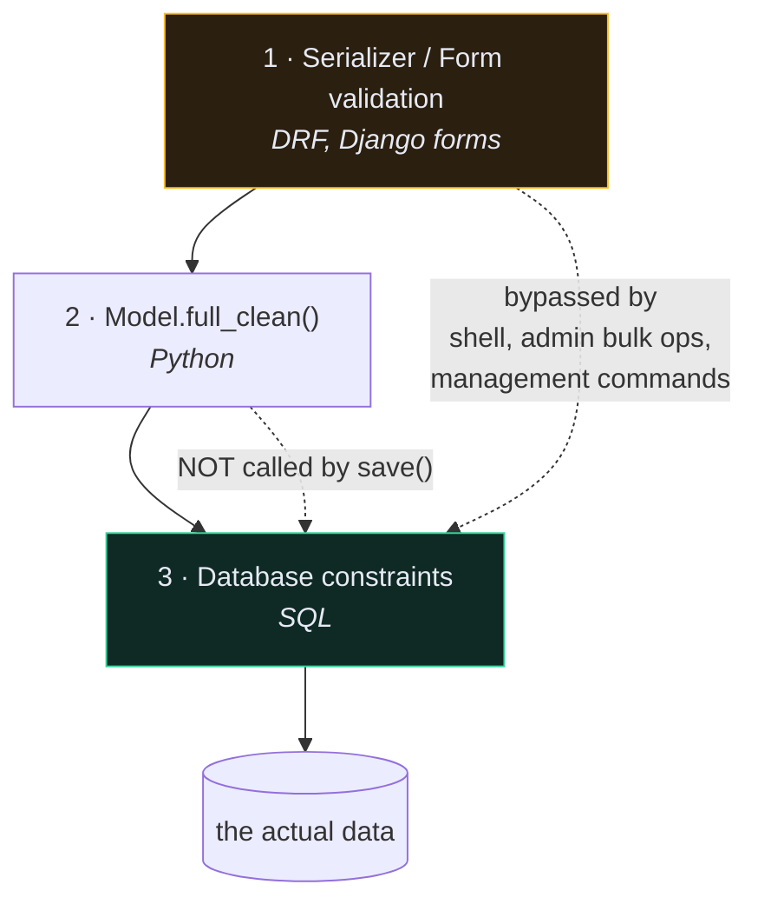

# 🛡️ Model Validation and Constraints

> 📖 [ref/models/constraints](https://docs.djangoproject.com/en/6.1/ref/models/constraints/) · [ref/models/instances](https://docs.djangoproject.com/en/6.1/ref/models/instances/#validating-objects)

---

## 🎯 There are three validation layers, and only one is guaranteed



| Layer | Runs when | Bypassed by |
| --- | --- | --- |
| Serializer / Form | `is_valid()` | shell, admin bulk actions, management commands, `objects.create()` |
| `full_clean()` | **only if you call it** | `save()` — which does *not* call it |
| Database constraint | every write, always | nothing |

> [!CAUTION] `Model.save()` does not validate
> ```python
> Recipe.objects.create(title="", time_minutes=-5, price=Decimal("-1"))
> ```
> That succeeds. `max_length`, `choices`, `validators` — none of them run on `save()`. They run in **forms and serializers**, which a shell session doesn't use.

---

## 🧩 `full_clean()`

```python
recipe = Recipe(title="", time_minutes=-5)

try:
    recipe.full_clean()
except ValidationError as e:
    print(e.message_dict)

recipe.save()
```

`full_clean()` runs three steps: `clean_fields()` → `clean()` → `validate_unique()` (and `validate_constraints()`).

```python
class Recipe(models.Model):
    ...
    def clean(self):
        """Cross-field validation on the model itself."""
        if self.time_minutes and self.time_minutes > 1440:
            raise ValidationError({"time_minutes": "A recipe cannot take more than a day."})
```

**Why Django doesn't call it automatically:** `full_clean()` can issue queries (uniqueness checks), and `save()` is used in loops, migrations and fixtures where that cost is unacceptable. It's a deliberate trade — and the reason the database layer matters.

---

## 🏛️ Constraints — the layer nothing bypasses

```python
class Recipe(models.Model):
    user = models.ForeignKey(settings.AUTH_USER_MODEL, on_delete=models.CASCADE)
    title = models.CharField(max_length=255)
    price = models.DecimalField(max_digits=5, decimal_places=2)
    time_minutes = models.IntegerField()

    class Meta:
        constraints = [
            models.UniqueConstraint(
                fields=["user", "title"],
                name="unique_recipe_title_per_user",
            ),
            models.CheckConstraint(
                condition=models.Q(price__gte=0),
                name="recipe_price_non_negative",
            ),
            models.CheckConstraint(
                condition=models.Q(time_minutes__gt=0),
                name="recipe_time_positive",
            ),
        ]
```

| Constraint | Enforces |
| --- | --- |
| `UniqueConstraint` | no duplicate combination of fields |
| `CheckConstraint` | a boolean condition on every row |
| `UniqueConstraint(condition=...)` | uniqueness only among rows matching a filter |
| `ExclusionConstraint` | PostgreSQL only — e.g. no overlapping date ranges |

> [!TIP] `condition=` not `check=`
> The `check` argument was renamed to `condition`. Older tutorials use `check=`; on 6.1 that's the deprecated spelling.

### Conditional uniqueness — the one people don't know exists

```python
models.UniqueConstraint(
    fields=["user", "title"],
    condition=models.Q(deleted_at__isnull=True),
    name="unique_active_recipe_title",
)
```

"Titles must be unique among *non-deleted* recipes." Impossible with `unique_together`; trivial here.

---

## 🤝 Constraints + serializers, together

Neither replaces the other:

| | Serializer validation | Database constraint |
| --- | --- | --- |
| Error quality | `{"title": ["Already used."]}` — usable by a frontend | `IntegrityError` — a 500 unless caught |
| Coverage | only requests through the API | **everything** |
| Race conditions | ❌ two concurrent requests both pass | ✅ the second one fails |

```python
# app/recipe/serializers.py — friendly 400
class Meta:
    validators = [
        UniqueTogetherValidator(
            queryset=Recipe.objects.all(),
            fields=["user", "title"],
            message="You already have a recipe with that title.",
        )
    ]
```

The serializer gives a good message. The constraint guarantees correctness when two requests arrive in the same millisecond and both pass validation before either writes. See [[get_or_create]] for the same race in nested writes.

---

## 🔢 Field validators

```python
from django.core.validators import MinValueValidator, MaxValueValidator

time_minutes = models.IntegerField(
    validators=[MinValueValidator(1), MaxValueValidator(1440)],
)
```

Validators run in `full_clean()` and in forms/serializers — **not** on `save()`. DRF's `ModelSerializer` does pick them up and turn them into serializer-level validation automatically, which is genuinely useful: declare it once on the model, get it in the API for free.

---

## ⚠️ Gotchas

- **A constraint added to a model with violating rows** → `migrate` fails. Clean the data in a `RunPython` migration first.
- **`CheckConstraint` referencing another table** → not possible; constraints are per-row.
- **`IntegrityError` reaching the client as a 500** → catch it, or mirror the constraint with serializer validation.
- **`null=True` on `CharField`** → two kinds of empty. Use `blank=True` only.
- **Constraint name collisions** → names are database-global in some backends. Prefix with the model name.

---

## 🧠 Check yourself

> [!QUESTION]
> 1. Why doesn't `save()` call `full_clean()`?
> 2. Give a case where serializer validation passes but the data is still wrong.
> 3. What can `UniqueConstraint(condition=...)` express that `unique_together` cannot?

---

## 🔗 Related

- [[7.Model Field Reference]] · [[2.Serializer Field Matrix]]
- [[6.Forms and Validation]] · [[8.Transactions]]
- [[0.Django Core Index]]
