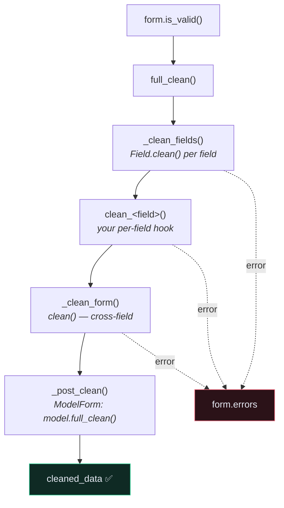

# 📝 Forms and Validation

> 📖 [topics/forms](https://docs.djangoproject.com/en/6.1/topics/forms/) · [ref/forms/validation](https://docs.djangoproject.com/en/6.1/ref/forms/validation/)

---

## 🤔 Why learn forms when you're building an API?

Because **DRF serializers are modelled on Django forms.** Same lifecycle, same method names, same design. Learn the original and the copy stops being mysterious.

| Django Form | DRF Serializer |
| --- | --- |
| `Form` | `Serializer` |
| `ModelForm` | `ModelSerializer` |
| `form.is_valid()` | `serializer.is_valid()` |
| `form.cleaned_data` | `serializer.validated_data` |
| `form.errors` | `serializer.errors` |
| `clean_<field>()` | `validate_<field>()` |
| `clean()` | `validate()` |
| `form.save()` | `serializer.save()` |
| `fields` / `exclude` in `Meta` | `fields` / `exclude` in `Meta` |

The one real difference: a Form also **renders HTML**. A serializer only handles data.

---

## 🔄 The validation lifecycle



**Field cleaning happens in three steps per field:** `to_python()` (coerce the type) → `validate()` (built-in rules) → `run_validators()` (your validator list).

---

## 🛠️ Writing one

```python
from django import forms


class RecipeForm(forms.Form):
    title = forms.CharField(max_length=255)
    time_minutes = forms.IntegerField(min_value=1)
    price = forms.DecimalField(max_digits=5, decimal_places=2)

    def clean_title(self):
        """One field. Returns the cleaned value."""
        title = self.cleaned_data["title"].strip()
        if len(title) < 3:
            raise forms.ValidationError("Title must be at least 3 characters.")
        return title

    def clean(self):
        """Cross-field. Returns the whole dict."""
        cleaned = super().clean()
        if cleaned.get("time_minutes", 0) > 1440:
            self.add_error("time_minutes", "A recipe cannot take more than a day.")
        return cleaned
```

Exactly the shape of a DRF serializer — and the same trap:

> [!WARNING] `clean_<field>()` must **return** the value
> Falling off the end returns `None` and stores it, silently. Identical to `validate_<field>()` in DRF. See [[Serializer Validation]].

---

## 🏗️ `ModelForm`

```python
class RecipeForm(forms.ModelForm):
    class Meta:
        model = Recipe
        fields = ["title", "time_minutes", "price", "link"]
        widgets = {"link": forms.URLInput(attrs={"placeholder": "https://"})}
        error_messages = {"title": {"max_length": "That title is too long."}}
```

```python
form = RecipeForm(request.POST, instance=recipe)
if form.is_valid():
    form.save()
```

`_post_clean()` is where a `ModelForm` calls the model's `full_clean()` — which is how model-level validators and `Model.clean()` reach a form. **`ModelSerializer` does the equivalent**, which is why a `MinValueValidator` declared on your model shows up in the API without you repeating it. See [[5.Model Validation and Constraints]].

---

## 🧩 Where forms still appear in an API project

Even with a pure JSON API, forms are running:

| Where | Form |
| --- | --- |
| **Django admin** | every add/change page is a `ModelForm` — `UserAdmin.add_fieldsets` configures one |
| **DRF browsable API** | the HTML POST form is rendered from your serializer |
| **`AuthenticationForm`** | admin login |
| **`PasswordResetForm`** | if you enable password reset |

That's why customising the admin for a [[Custom User Model|custom user model]] means fighting `UserChangeForm` and `UserCreationForm` — see [[4.Fix the User Change Page]].

---

## 🎯 When to use a form instead of a serializer

| Use a form | Use a serializer |
| --- | --- |
| Server-rendered HTML page | JSON API |
| Django admin customisation | anything DRF |
| A management command taking structured input | — |
| File upload in a Django view | DRF `MultiPartParser` |

In an API-only project you'll mostly *read* forms rather than write them — in the admin, and in third-party packages.

---

## ⚠️ Gotchas

- **`form.cleaned_data` missing a key** → that field failed validation; it's excluded. Always `.get()`.
- **`clean()` returning `None`** → `cleaned_data` becomes `None`. Return `cleaned`.
- **`self.add_error()` vs `raise ValidationError`** in `clean()` → `add_error` attaches to a named field and lets validation continue; `raise` produces `__all__` and stops.
- **`is_valid()` on an unbound form** → always `False`. A form with no data passed is unbound.
- **Empty `CharField` gives `""`, not `None`** → same reason `null=True` on a `CharField` is wrong.

---

## 🧠 Check yourself

> [!QUESTION]
> 1. Which serializer method corresponds to `clean_<field>()`, and what do they share as a failure mode?
> 2. What does `_post_clean()` do in a `ModelForm`, and what is DRF's equivalent?
> 3. Where do forms still run in a JSON-only Django project?

---

## 🔗 Related

- [[Serializer Validation]] · [[2.Serializer Field Matrix]]
- [[5.Model Validation and Constraints]] · [[Django Admin]]
- [[0.Django Core Index]]
