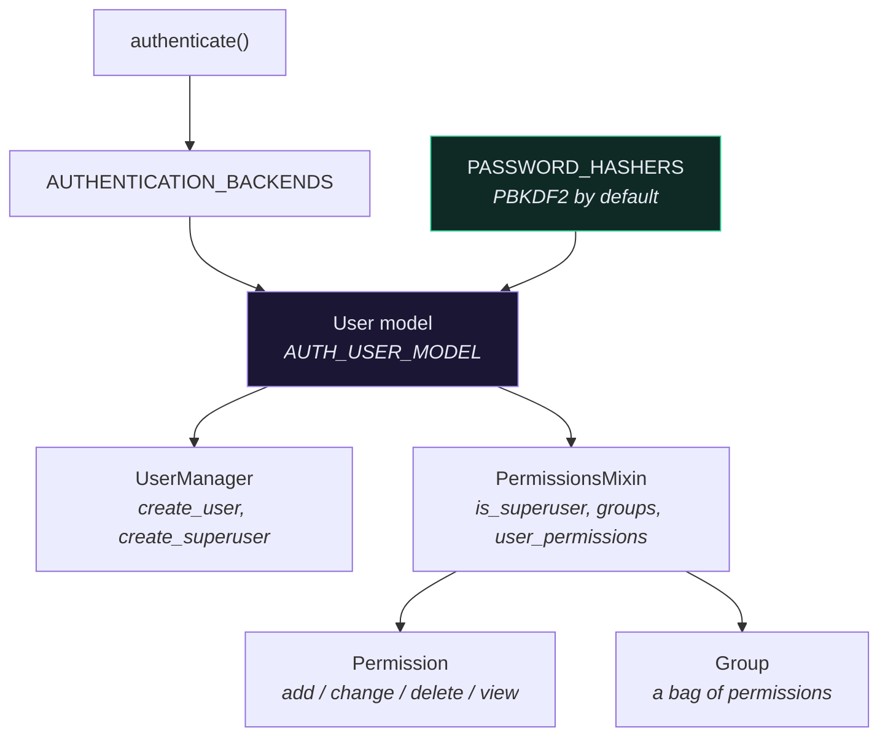

# 👥 The Auth System

> 📖 [topics/auth](https://docs.djangoproject.com/en/6.1/topics/auth/) · [topics/auth/customizing](https://docs.djangoproject.com/en/6.1/topics/auth/customizing/)

---

## 🧩 The parts



---

## 🔐 Password hashing

Django stores a one-way hash, never the password:

```text
pbkdf2_sha256$1500000$KxvT2s...$9zN4bM...
    │             │        │        │
 algorithm   iterations   salt     hash
```

**Django 6.1 raised PBKDF2 iterations from 1,200,000 to 1,500,000.** Existing hashes upgrade transparently: on the next successful login Django notices the stored iteration count is below the current default and re-hashes.

```python
user.set_password(raw)       # ✅ hashes
user.check_password(raw)     # ✅ compares
user.password = raw          # ❌ stores plaintext, silently
```

```python
PASSWORD_HASHERS = [
    "django.contrib.auth.hashers.PBKDF2PasswordHasher",
    "django.contrib.auth.hashers.PBKDF2SHA1PasswordHasher",
    "django.contrib.auth.hashers.Argon2PasswordHasher",
    "django.contrib.auth.hashers.BCryptSHA256PasswordHasher",
]
```

The first entry is used for new passwords; the rest are accepted for verification and upgraded on login. **Argon2 is the stronger choice** if you can add the dependency (`pip install django[argon2]`) — put it first.

> [!TIP] Speed up your test suite by 10×
> PBKDF2 at 1.5M iterations is deliberately slow. Every `create_user()` in every test pays it.
> ```python
> # test settings
> PASSWORD_HASHERS = ["django.contrib.auth.hashers.MD5PasswordHasher"]
> ```
> Test settings **only**. Never anywhere near production.

---

## 🎭 `authenticate()` and backends

```python
from django.contrib.auth import authenticate

user = authenticate(request=request, username=email, password=password)
```

`authenticate()` tries each backend in `AUTHENTICATION_BACKENDS` until one returns a user. Note the parameter is still called `username` even when `USERNAME_FIELD = "email"` — it maps to whatever your `USERNAME_FIELD` is. That's why [[ObtainAuthToken|`AuthTokenSerializer`]] passes `username=attrs.get("email")`.

A custom backend — e.g. login by email *or* phone:

```python
class EmailOrPhoneBackend(BaseBackend):
    def authenticate(self, request, username=None, password=None, **kwargs):
        try:
            user = User.objects.get(Q(email=username) | Q(phone=username))
        except User.DoesNotExist:
            User().set_password(password)     # constant-time: don't leak existence
            return None
        if user.check_password(password) and user.is_active:
            return user

    def get_user(self, user_id):
        return User.objects.filter(pk=user_id).first()
```

> [!CAUTION] The dummy `set_password` is not pointless
> Returning early when the user doesn't exist makes the "no such user" path measurably faster than the "wrong password" path. That timing difference is an account-enumeration oracle. Django's own `ModelBackend` does the same thing.

---

## 🛂 Permissions and groups

Django auto-creates four permissions per model: `add_x`, `change_x`, `delete_x`, `view_x`.

```python
user.has_perm("core.add_recipe")
user.has_perms(["core.add_recipe", "core.change_recipe"])
user.get_all_permissions()

group = Group.objects.create(name="Editors")
group.permissions.add(Permission.objects.get(codename="change_recipe"))
user.groups.add(group)
```

`is_superuser=True` short-circuits **every** `has_perm()` check to `True` — it doesn't grant permissions, it bypasses the question.

```python
class Meta:
    permissions = [("publish_recipe", "Can publish recipe")]
```

> [!INFO] DRF mostly ignores this
> Django's permission framework is built for the **admin** and for server-rendered views. DRF has its own [[Permissions|permission classes]], and this project's authorization is queryset filtering by owner — not model permissions. `DjangoModelPermissions` bridges the two if you want it, but per-object ownership is not what the model-permission system was designed for.

Django 6.1 renamed `Permission.name` and `Permission.codename` (with migrations) and added `Permission.user_perm_str`.

---

## 👤 `AnonymousUser`

```python
request.user.is_authenticated      # False
request.user.is_anonymous          # True
request.user.id                    # None
request.user.has_perm("anything")  # False
```

It implements the whole `User` interface so your code doesn't need `if request.user is None` everywhere. But it is **truthy**:

```python
if request.user:                    # ❌ always True
if request.user.is_authenticated:   # ✅
```

---

## 🔑 Password validation

```python
AUTH_PASSWORD_VALIDATORS = [
    {"NAME": "django.contrib.auth.password_validation.UserAttributeSimilarityValidator"},
    {"NAME": "django.contrib.auth.password_validation.MinimumLengthValidator",
     "OPTIONS": {"min_length": 10}},
    {"NAME": "django.contrib.auth.password_validation.CommonPasswordValidator"},
    {"NAME": "django.contrib.auth.password_validation.NumericPasswordValidator"},
]
```

`CommonPasswordValidator` checks a bundled list of the 20,000 most common passwords — cheap and effective.

**These do not run automatically on `set_password()`.** Forms and DRF serializers call `validate_password()` for you; a shell session doesn't. To enforce it in your own serializer:

```python
from django.contrib.auth.password_validation import validate_password

def validate_password(self, value):
    validate_password(value)
    return value
```

---

## ⚠️ Gotchas

- **`AUTH_USER_MODEL` changed after the first `migrate`** → `InconsistentMigrationHistory`. Set it on day one.
- **Direct `from core.models import User`** → circular imports and breaks model swapping. Use `settings.AUTH_USER_MODEL` in FKs, `get_user_model()` in code.
- **`get_user_model()` at module import time** → `AppRegistryNotReady`. Call it inside a function.
- **Password returned by the API** → missing `write_only`.
- **Tests slow** → the hasher. See the tip above.
- **`user.has_perm()` always `True`** → the user is a superuser.

---

## 🧠 Check yourself

> [!QUESTION]
> 1. Why does `authenticate()` still take a `username` argument when `USERNAME_FIELD` is `email`?
> 2. Why does `ModelBackend` hash a password even when the user doesn't exist?
> 3. Why doesn't this project use Django's model permissions for authorization?

---

## 🔗 Related

- [[Custom User Model]] · [[Password Hashing]] · [[Permissions]]
- [[1.Custom User Model in Django]] · [[ObtainAuthToken]]
- [[9.Security Features]] · [[0.Django Core Index]]
