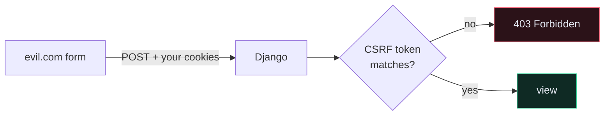

# 🔒 Security Features

> 📖 [topics/security](https://docs.djangoproject.com/en/6.1/topics/security/) · [ref/csp](https://docs.djangoproject.com/en/6.1/ref/csp/)
>
> The **checklist** is [[10.Security Checklist]]. This note is what Django does for you, and where it stops.

---

## 🛡️ What you get for free — and how to lose it

| Threat | Django's protection | You lose it by |
| --- | --- | --- |
| **SQL injection** | QuerySets parameterise every query | f-strings inside `raw()` / `extra()` / `RawSQL` |
| **XSS** | templates auto-escape | `mark_safe()`, `\|safe`, unquoted attributes |
| **CSRF** | `CsrfViewMiddleware` + per-user token | `@csrf_exempt` |
| **Clickjacking** | `X-Frame-Options: DENY` | removing `XFrameOptionsMiddleware` |
| **Host header poisoning** | `ALLOWED_HOSTS` | `ALLOWED_HOSTS = ["*"]`, or reading `request.META["HTTP_HOST"]` directly |
| **Password cracking** | PBKDF2, 1.5M iterations | assigning `user.password` directly |
| **Content injection** | CSP *(since 6.0)* | not enabling it |

---

## 💉 SQL injection

```python
# ❌ injectable
Recipe.objects.raw(f"SELECT * FROM core_recipe WHERE title = '{title}'")
Recipe.objects.extra(where=[f"title = '{title}'"])

# ✅ parameterised — the driver escapes the value
Recipe.objects.raw("SELECT * FROM core_recipe WHERE title = %s", [title])

# ✅ best: don't use raw
Recipe.objects.filter(title=title)
```

The ORM sends SQL and parameters **separately**. There is no string to inject into. The only way to be vulnerable is to opt out.

> [!CAUTION] `%s` is not string formatting here
> `cursor.execute("... WHERE id = %s", [x])` passes `x` to the driver as a parameter. `cursor.execute("... WHERE id = %s" % x)` interpolates it into the SQL first. One character apart; completely different security properties.

---

## 🔤 XSS and auto-escaping

Django templates escape `<`, `>`, `'`, `"` and `&` by default. Two ways it still bites:

```django
{# ✅ safe — quoted attribute #}
<div class="{{ user_input }}">

{# ⚠️ unquoted — user_input can break out with a space #}
<div class={{ user_input }}>
```

```django
{{ user_bio|safe }}          {# ❌ renders raw HTML #}
...
```

**For a JSON API this mostly doesn't apply** — `JSONRenderer` escapes correctly and there's no template. The risk moves to your frontend: if it does `innerHTML = response.description`, you've reintroduced XSS on the client. Your API returning unescaped user text is correct; rendering it as HTML is not.

---

## 🎫 CSRF

An attacker's page submits a form to your site; the browser attaches the victim's cookies. Django defeats it with a secret token the attacker can't read.



**Token auth is not vulnerable to CSRF**, because the browser doesn't attach an `Authorization` header automatically — the attacker's page cannot cause one to be sent. That's a genuine security advantage of [[Token Authentication|token auth]] over cookies for cross-origin APIs, not just convenience.

You'll still meet CSRF here through DRF's [[SessionAuthentication]] (the browsable API and the admin). A `403 CSRF Failed` from `curl` means you hit a session-authenticated path.

```python
CSRF_COOKIE_SECURE = True
CSRF_COOKIE_HTTPONLY = False       # JS must read it to send the header
CSRF_TRUSTED_ORIGINS = ["https://api.example.com"]
```

---

## 🔐 HTTPS settings

```python
if not DEBUG:
    SECURE_SSL_REDIRECT = True
    SECURE_PROXY_SSL_HEADER = ("HTTP_X_FORWARDED_PROTO", "https")
    SESSION_COOKIE_SECURE = True
    CSRF_COOKIE_SECURE = True
    SECURE_HSTS_SECONDS = 2592000
    SECURE_HSTS_INCLUDE_SUBDOMAINS = True
    SECURE_HSTS_PRELOAD = True
    SECURE_CONTENT_TYPE_NOSNIFF = True
    X_FRAME_OPTIONS = "DENY"
```

> [!CAUTION] Two of these can take your site down
> **`SECURE_PROXY_SSL_HEADER`** trusts a header. If anything can reach Django *without* passing through your proxy, an attacker sets `X-Forwarded-Proto: https` and Django believes the connection is secure. Only set it when the proxy is the sole path in, and the proxy strips the incoming header.
>
> **`SECURE_HSTS_SECONDS`** tells browsers never to use HTTP for this domain again. If TLS then breaks, visitors cannot reach you at all and you cannot undo it for them. Get HTTPS working, set a small value, raise it later.

---

## 🏠 `ALLOWED_HOSTS`

Django validates the `Host` header against `ALLOWED_HOSTS` and returns `400` on a mismatch. This blocks cache poisoning and poisoned password-reset links.

```python
ALLOWED_HOSTS = ["api.example.com"]      # ✅
ALLOWED_HOSTS = ["*"]                    # ❌ disables the protection entirely
```

> [!WARNING] The protection only works via `get_host()`
> `request.get_host()` validates. `request.META["HTTP_HOST"]` does not. Code that builds URLs from the raw header bypasses the check completely.

---

## 🧱 Content Security Policy *(since Django 6.0)*

CSP tells the browser which sources of script, style and images to trust — a second line of defence when XSS gets through.

```python
MIDDLEWARE = [
    "django.middleware.csp.ContentSecurityPolicyMiddleware",
    ...
]

SECURE_CSP = {
    "default-src": ["'self'"],
    "script-src": ["'self'", "'nonce'"],
    "img-src": ["'self'", "data:"],
    "frame-ancestors": ["'none'"],
}
```

Django generates a fresh nonce per request. Django 6.1 adds the `csp_nonce_attr` template tag:

```django
<script >...</script>
```

For a JSON API, `default-src 'none'` is a reasonable posture — your API serves no scripts at all. It matters most for `/admin/` and `/api/docs/`.

---

## 📤 User uploads

```python
DATA_UPLOAD_MAX_MEMORY_SIZE = 5 * 1024 * 1024
FILE_UPLOAD_MAX_MEMORY_SIZE = 5 * 1024 * 1024
DATA_UPLOAD_MAX_NUMBER_FIELDS = 1000
```

Django's advice, which people skip:

- **Serve user content from a different top-level domain**, not a subdomain — a subdomain shares cookie scope with your app.
- **Allowlist extensions.** Never trust a client-supplied filename or content type.
- **Cap the size at the web server too** (`client_max_body_size` in nginx). Django's limits apply after the bytes have already arrived.
- Rename uploads to a UUID — which [[path generator function|this project does]], and which also prevents path traversal via `../../`.

---

## ⚠️ Gotchas

- **Everything 400s after deploy** → `ALLOWED_HOSTS`.
- **Infinite HTTPS redirect loop** → `SECURE_SSL_REDIRECT=True` behind a proxy without `SECURE_PROXY_SSL_HEADER`.
- **`403 CSRF Failed` on an API call** → session auth path; use token auth.
- **A 500 renders your settings** → `DEBUG` is truthy. See the `bool(int(...))` trap in [[4.Environment Variables and Secrets]].
- **`check --deploy` warnings ignored** → each one is a real, exploited class of bug.

---

## 🧠 Check yourself

> [!QUESTION]
> 1. Why is token auth structurally immune to CSRF while cookie auth isn't?
> 2. When does `SECURE_PROXY_SSL_HEADER` become a vulnerability?
> 3. Why does Django recommend a separate *domain* — not subdomain — for user uploads?

---

## 🔗 Related

- [[10.Security Checklist]] · [[6.Post-Deploy Checklist]]
- [[3.Middleware]] · [[7.The Auth System]]
- [[0.Django Core Index]]
