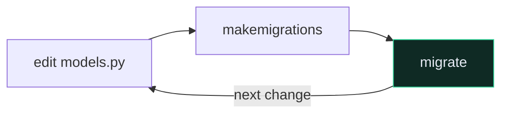

# 🗃️ Django Models

**One class = one table. One attribute = one column.** That's the whole idea of an ORM.

```python
from django.db import models


class Recipe(models.Model):
    user = models.ForeignKey(settings.AUTH_USER_MODEL, on_delete=models.CASCADE)
    title = models.CharField(max_length=255)
    description = models.TextField(blank=True)
    time_minutes = models.IntegerField()
    price = models.DecimalField(max_digits=5, decimal_places=2)
    tags = models.ManyToManyField("Tag")

    def __str__(self):
        return self.title
```

Subclassing `models.Model` gives you `.objects.all()`, `.save()`, `.delete()` for free.

`__str__` costs one line and is what shows up in `/admin` and the shell. Always write it.

**The loop you will repeat forever:**



Forgetting `migrate` is the #1 "why isn't my change showing up" bug, for everyone, always.

```bash
docker compose run --rm app sh -c "python manage.py makemigrations && python manage.py migrate"
```

> [!WARNING] A new app does nothing until you register it
> ```python
> INSTALLED_APPS = [..., "core"]
> ```

![[data-model-erd.svg]]

---

## 🔗 Deeper

- [[7.Model Field Reference]] — every field type and option
- [[4.Django ORM Cookbook]] — querying
- [[Django Migrations]] · [[ForeignKey Relationships]] · [[ManyToMany Relationships]]
