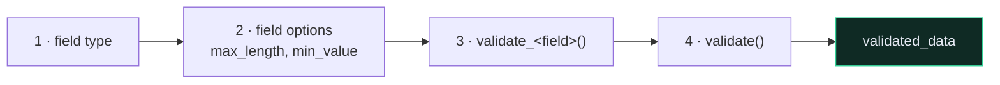

# ✅ Serializer Validation

Four layers run in order. Any failure short-circuits to **400**.



```python
def validate_title(self, value):
    """One field. Receives and RETURNS the value."""
    if len(value.strip()) < 3:
        raise serializers.ValidationError("Title must be at least 3 characters.")
    return value.strip()


def validate(self, attrs):
    """Cross-field. Receives and returns the whole dict."""
    if attrs["password"] == attrs["name"]:
        raise serializers.ValidationError({"password": "Password cannot equal name."})
    return attrs
```

> [!WARNING] `validate_<field>` must `return`
> Falling off the end returns `None`, and DRF stores it. No error, no warning — just a null in your database. The validation half still works, so it looks tested.

> [!TIP] Raise with a dict to attach the error to a field
> `ValidationError("msg")` → `{"non_field_errors": ["msg"]}`
> `ValidationError({"field": "msg"})` → `{"field": ["msg"]}` — far more useful to a frontend.

**Validation is not a constraint.** It can be bypassed by the admin, a management command, or a shell session. For anything that must always hold, add a database `CheckConstraint` too.

---

## 🔗 Deeper

- [[2.Serializer Field Matrix]]
- [[Serializers]] · [[Serializer create and update]]
- [[1.HTTP Status Codes]]
