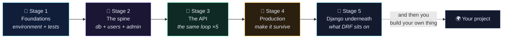
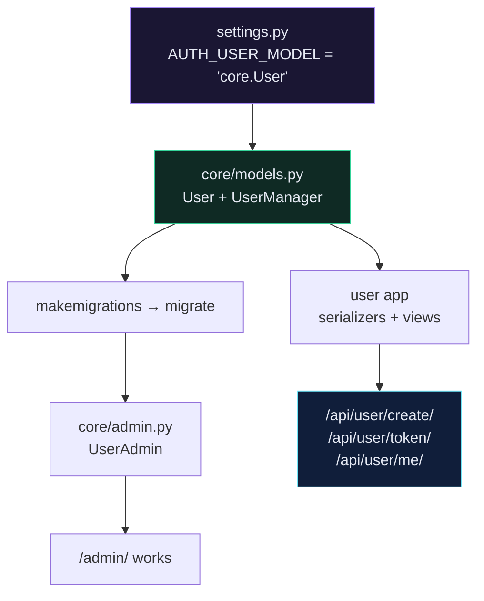
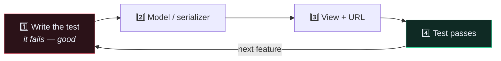

# 🧭 Learning Path

> [!TIP] How to use this page
> **First pass:** read top to bottom, building the project as you go. Don't skip Stage 1 — it is the least exciting and the most load-bearing.
> **Every pass after:** ignore this page, use [[Map of Content]] and search.

![[learning-path.svg]]

---

## Exit checks by stage

Use this as a quick audit before moving to the next stage.

### Stage 1 — Foundations complete when

- Docker Compose can run the project.
- `flake8` and the first test run pass locally (or in CI).
- You can run your first failing test, then make it pass.

### Stage 2 — The spine complete when

- `AUTH_USER_MODEL` is set and migrations are in a clean state.
- `wait_for_db` and database readiness are covered by tests.
- Admin pages can create/edit users with a custom user model.

### Stage 3 — API build complete when

- For each of six API sections, you completed: test → serializer/model → view/URL → passing tests.
- You can explain one endpoint end-to-end without looking at code.
- You have coverage for authentication and ownership checks where required.

### Stage 4 — Production complete when

- You can deploy once with production settings.
- You have a hardening checklist and at least one monitoring check wired.
- Security basics are verified (`DEBUG=False`, secret config, rate limiting where applicable).

### Stage 5 — Django fundamentals complete when

- You can trace a request from middleware to database query behavior.
- You can explain and measure one real optimization point (for example N+1).
- You can read a traceback and map it back to framework internals.

## The shape of the journey

> [!INFO] Stage 5 is not "last"
> [[0.Django Core Index|Django Core]] is written as a **companion**, not a finale. Dip into it the moment a note assumes something you don't know — what middleware is, how a QuerySet becomes SQL, why `save()` doesn't validate. Reading it cover-to-cover at the end also works; reading it never does not.

---

## Stage 1 — Foundations

**Goal:** `docker compose up` works, `flake8` is clean, one test runs and fails on purpose.

| #   | Section         | What you actually learn                                          | Done when                              |
| --- | --------------- | ---------------------------------------------------------------- | -------------------------------------- |
| 01  | App Design      | The 19 endpoints you're heading toward                            | You can draw the endpoint map yourself |
| 02  | System Setup    | Docker, Docker Compose, an editor, Git                            | `docker --version` works               |
| 03  | Test Driven Development | Red → green → refactor, unit tests, assertions            | You write the test *first* once        |
| 04  | Project Setup   | Dockerfile, compose, requirements, flake8, `startproject`         | The dev server answers on :8000        |
| 05  | GitHub Actions  | CI that runs your tests and linter on every push                  | Green tick on GitHub                   |

> [!WARNING] The trap in Stage 1
> Almost everyone rushes this to "get to the real Django". Then they spend Stage 3 debugging their environment instead of their code. **Docker + CI + flake8 first.** It is the whole point.

---

## Stage 2 — The spine

**Goal:** a Postgres-backed project with a custom user model and a working admin.

| #   | Section            | The one idea that matters                                                            |
| --- | ------------------ | ------------------------------------------------------------------------------------ |
| 06  | Configure Database | Postgres starts *slower* than Django → `wait_for_db` is a real production pattern      |
| 07  | TDD with Django    | `TestCase`, mocking, and the test failures you'll actually hit                          |
| 08  | Custom User Model  | Swap it on **day one**. Swapping later is a migration nightmare.                       |
| 09  | Django Admin       | Free CRUD UI. Register a model, get a back office for nothing.                          |
| 10  | API Documentation  | `drf-spectacular` reads your code → docs can never go stale                             |

---

## Stage 3 — Building the API

**Goal:** 19 endpoints, all tested.

Every single one of these five sections is the *same four steps*. Once you see the pattern, the rest is typing:

| #   | Section        | New concept introduced                                       |
| --- | -------------- | ------------------------------------------------------------ |
| 11  | User API       | Token auth, `write_only`, `IsAuthenticated`                  |
| 12  | Recipe API     | `ModelViewSet`, routers, `get_serializer_class()`            |
| 13  | Tag API        | Nested serializers, `get_or_create` on write                  |
| 14  | Ingredient API | Refactoring two viewsets into one base class                  |
| 15  | Image API      | `@action`, `MultiPartParser`, media files                     |
| 16  | Filtering      | Query params, `OpenApiParameter`, comma-separated IDs         |

---

## Stage 4 — Production

**Goal:** it survives contact with the internet.

| #   | Section         | What it covers                                                            |
| --- | --------------- | ------------------------------------------------------------------------- |
| 17  | Deployment      | Production compose, uWSGI, nginx proxy, env vars, `collectstatic`          |
| 18  | All Fixes       | The Django refresher + the errors you will actually hit                     |
| 19  | Production DRF  | Pagination, throttling, caching, N+1, permissions, JWT, transactions, Celery |
| 20  | Reference       | Cheat sheets you will open weekly for years                                 |
| 21  | Interview       | Q&A, ADRs, decision trees, war stories                                      |

---

## Stage 5 — Django underneath

**Goal:** stop treating the layer below DRF as magic.

| #   | Section       | What it covers                                                                 |
| --- | ------------- | ------------------------------------------------------------------------------ |
| 22  | Django Core   | Settings, middleware, QuerySets and `fetch_mode`, model constraints, forms, the auth system, caching, security, async, Mailers, management commands, i18n |
| 23  | What to Master Next | The roadmap beyond this vault                                            |

Written against **Django 6.1** (released 5 August 2026). If you're upgrading an existing project, start at [[1.What's New in Django 6.1]] — it lists everything in this vault that release dates, and why.

---

## A realistic schedule

| Pace                        | Stage 1 | Stage 2 | Stage 3 | Stage 4 |
| --------------------------- | ------- | ------- | ------- | ------- |
| **Sprint** (full-time)      | 2 days  | 2 days  | 4 days  | 3 days  |
| **Steady** (2h/day)         | 1 week  | 1 week  | 2 weeks | 2 weeks |
| **Weekend** (Sat mornings)  | 3 weeks | 3 weeks | 6 weeks | 5 weeks |

> [!NOTE] Honest advice
> Stage 3 feels fast because it repeats. Stage 4 feels slow because nothing repeats. Budget accordingly — and do not treat Stage 4 as optional. The gap between "works on my machine" and "works" is exactly Stage 4.

---

## Related

- [[Noetix Home]]
- [[Map of Content]]
- [[DRF Mastery Roadmap]] — what to learn *after* this vault
