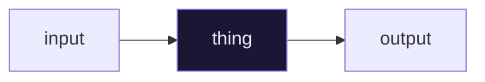

# {{title}}

> One sentence: what this note lets you do that you couldn't before.

---

## 🎯 Core Concept

The idea in three sentences. No code yet.

---

## 🤔 Why

Why does this exist? What breaks without it? What was the naive approach and what went wrong with it?

> [!INFO]
> Context that would otherwise cost you a docs dive.

---

## 🛠️ Implementation

```python
# app/<app>/<file>.py
```

**Step by step**

1.
2.
3.

---

## 🔬 The test first

```python
def test_something(self):
    """Plain-English description of the behaviour."""
    res = self.client.get(URL)

    self.assertEqual(res.status_code, status.HTTP_200_OK)
```

---

## 🗺️ Diagram



---

## ⚠️ Gotchas

> [!WARNING]
> The mistake you will make the first time.

- **Symptom →** cause → fix
- **Symptom →** cause → fix

---

## 🧠 Check yourself

> [!QUESTION]
> 1.
> 2.

---

## 🔗 Related

- [[ ]]
- [[ ]]
