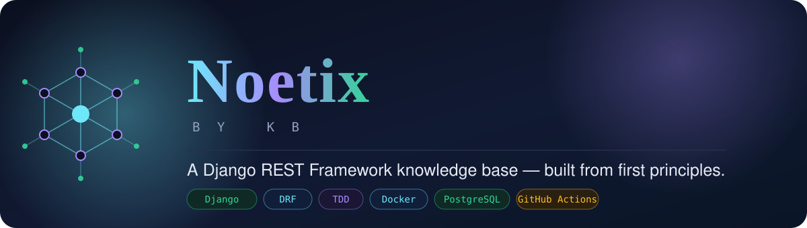
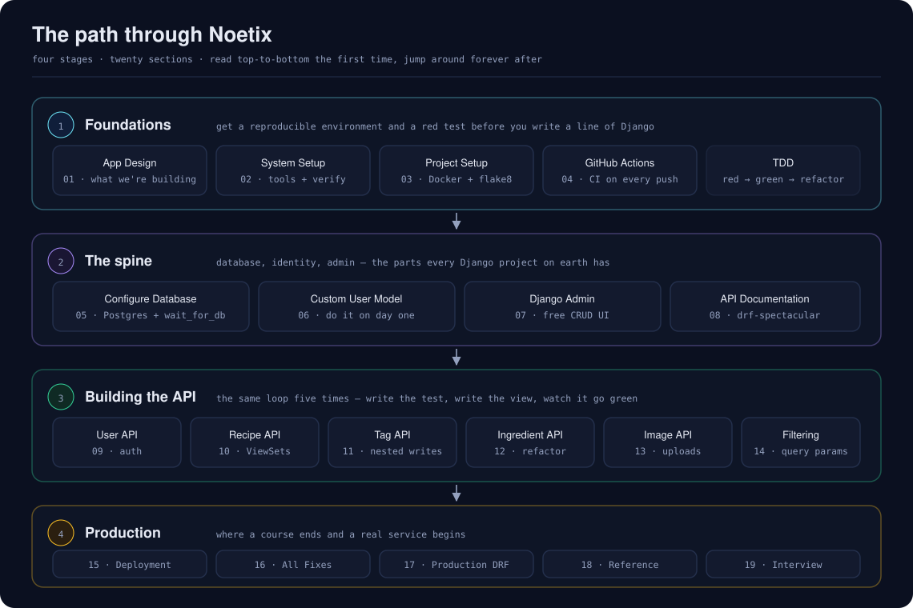
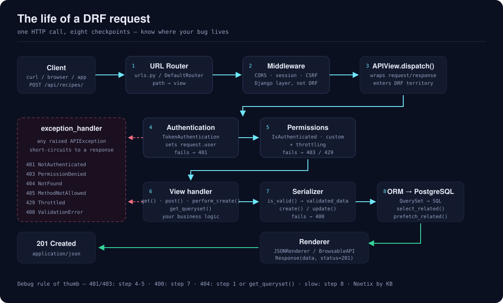
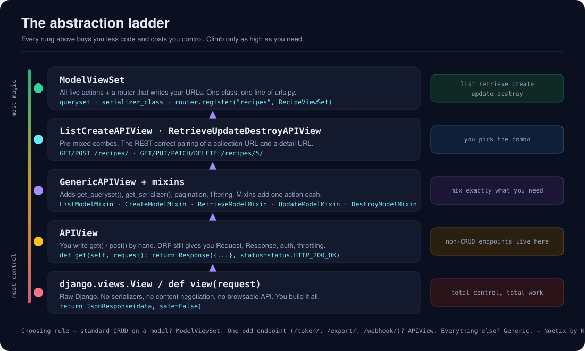
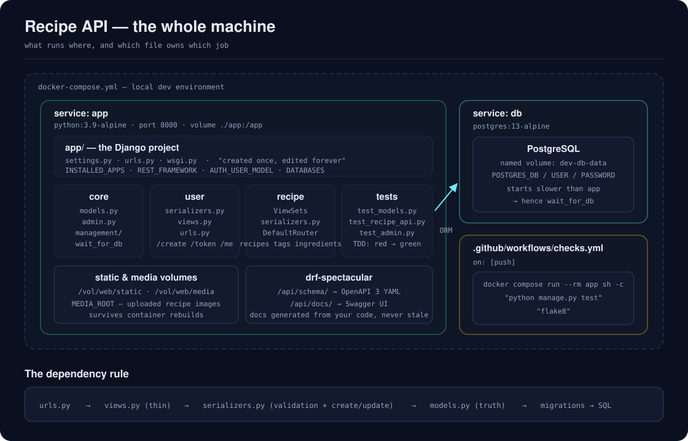

<div align="center">



<br>

**A Django REST Framework knowledge base — built from first principles.**

150+ interlinked notes · 8 hand-drawn diagrams · 4 Obsidian canvases · every gotcha, written down

<br>


</div>

---

## What this is

> *noetic* — of or relating to the intellect; knowledge apprehended directly by the mind.

**Noetix** started as study notes taken while working through a Django REST Framework course — one note per video, summarised from the subtitles. It has since grown past the course into a reference system for building, shipping and operating a real DRF API.

Every note answers four questions in the same order: **what is this**, **why does it exist**, **how do I write it**, and **how does it bite me**. The first and third are in the docs. The second and fourth are why this repo exists.

**Read it two ways:**

- **On GitHub** — every note is plain Markdown; Mermaid diagrams and SVGs render inline
- **In [Obsidian](https://obsidian.md)** — clone into your vault for backlinks, graph view, and the canvas boards

---

## Start here

| If you are… | Go to |
| --- | --- |
| new to DRF | [Learning Path](EN/_Noetix/Learning%20Path.md) |
| looking for one specific note | [Map of Content](EN/_Noetix/Map%20of%20Content.md) |
| stuck on a bug right now | [Debugging Decision Tree](EN/21.Interview%20and%20Real%20World/Debugging%20Decision%20Tree.md) |
| on Django 6.1 (or upgrading) | [What's New in Django 6.1](EN/22.Django%20Core/1.What's%20New%20in%20Django%206.1.md) |
| about to deploy | [Production Readiness Checklist](EN/19.Production%20DRF/0.Production%20Readiness%20Checklist.md) |
| looking something up | [Reference Index](EN/20.Reference/0.Reference%20Index.md) |
| preparing for an interview | [Interview Index](EN/21.Interview%20and%20Real%20World/0.Interview%20Index.md) |

Or open [Noetix Home](EN/_Noetix/Noetix%20Home.md) — the dashboard everything hangs off.

---

## Languages

| | | |
| --- | --- | --- |
| 🇬🇧 **English** | [`EN/`](EN) | ✅ complete — [start here](EN/_Noetix/Noetix%20Home.md) |
| 🇸🇦 **العربية** | [`AR/`](AR) | 🚧 in progress — [ابدأ من هنا](AR/_Noetix/الصفحة%20الرئيسية.md) |

Diagrams in [`assets/`](assets) are shared by both editions.

The Arabic edition translates the **concept and reference layers first** — the pages you reopen and search — rather than working front-to-back through the course. Prose is Arabic; code, function names and error messages stay in English, because that's how you'll meet them in the terminal.

---

## The map

<div align="center">

</div>

---

## Contents

### 🧱 Stage 1 — Foundations

*Get a reproducible environment and a failing test before you write a line of Django.*

| | Section | Covers |
| --- | --- | --- |
| 01 | [App Design](EN/01.App%20Design) | The brief: 19 endpoints, auth, browsable API |
| 02 | [System Setup](EN/02.System%20Setup) | Docker, Compose, verifying the toolchain |
| 03 | [Test Driven Development](EN/03.Test%20Driven%20Development) | Red → green → refactor |
| 04 | [Project Setup](EN/04.Project%20Setup) | Dockerfile, compose, requirements, flake8 |
| 05 | [GitHub Actions](EN/05.GitHub%20Actions) | CI running tests and lint on every push |

### 🦴 Stage 2 — The spine

*Database, identity, admin. The parts every Django project on earth has.*

| | Section | Covers |
| --- | --- | --- |
| 06 | [Configure Database](EN/06.Configure%20Database) | PostgreSQL, migrations, `wait_for_db` |
| 07 | [TDD with Django](EN/07.TDD%20with%20Django) | `TestCase`, mocking, common test failures |
| 08 | [Create User Model](EN/08.Create%20User%20Model) | Custom user model, email as identifier |
| 09 | [Setup Django Admin](EN/09.Setup%20Django%20Admin) | Free CRUD back office |
| 10 | [Documentation API](EN/10.Documentation%20API) | drf-spectacular, OpenAPI, Swagger UI |

### 🔌 Stage 3 — Building the API

*The same loop, five times.*

| | Section | Covers |
| --- | --- | --- |
| 11 | [Build User API](EN/11.Build%20User%20API) | Token auth, `write_only`, `/me/` |
| 12 | [Build Recipe API](EN/12.Build%20Recipe%20API) | `ModelViewSet`, routers, serializer selection |
| 13 | [Build Tag API](EN/13.Build%20Tag%20API) | Nested serializers, `get_or_create` writes |
| 14 | [Build Ingredient API](EN/14.Build%20Ingredient%20API) | Extracting a shared base viewset |
| 15 | [Build Image API](EN/15.Build%20Image%20API) | `@action`, `MultiPartParser`, media files |
| 16 | [Implement Filtering](EN/16.Implement%20Filtering) | Query params, `OpenApiParameter` |

### 🚀 Stage 4 — Production

*Where a course ends and a service begins.*

| | Section | Covers |
| --- | --- | --- |
| 17 | [Deployment](EN/17.Deployment) | Production compose, uWSGI, nginx, secrets, post-deploy checks |
| 18 | [All Fixes](EN/18.All%20Fixes) | Django refresher + the errors you'll actually hit |
| 19 | [Production DRF](EN/19.Production%20DRF) | Pagination, throttling, caching, N+1, permissions, JWT, signals, transactions, Celery, security, logging, versioning |
| 20 | [Reference](EN/20.Reference) | Status codes, serializer fields, ViewSets, ORM, testing, Docker, models, glossary |
| 21 | [Interview & Real World](EN/21.Interview%20and%20Real%20World) | Q&A, war stories, ADRs, debugging method |

### 🧱 Stage 5 — Django underneath

*DRF is a layer on top of Django. The course teaches the layer.*

| | Section | Covers |
| --- | --- | --- |
| 22 | [Django Core](EN/22.Django%20Core) | Written against **Django 6.1**: what's new and what it breaks, settings, middleware, querysets and `fetch_mode`, model constraints, forms, the auth system, caching, security, async, Mailers, management commands, i18n |
| 23 | [What to Master Next](EN/23.What%20to%20Master%20Next) | The roadmap beyond this vault |

### 🧩 The concept layer

[`EN/_Concepts/`](EN/_Concepts) holds 29 short definition notes for the ideas that recur across sections — [`Token Authentication`](EN/_Concepts/Token%20Authentication.md), [`Permissions`](EN/_Concepts/Permissions.md), [`get_or_create`](EN/_Concepts/get_or_create.md), [`Decimal vs Float`](EN/_Concepts/Decimal%20vs%20Float.md) and the rest. Each is a page you read in a minute, linking out to the note that treats it properly. Start at the [Concept Index](EN/_Concepts/0.Concept%20Index.md).

---

## The diagrams

Eight hand-authored SVGs live in [`assets/`](assets). They render identically in Obsidian and on GitHub, in light and dark.

<div align="center">

<br><br>

</div>

| File | Shows |
| --- | --- |
| [`noetix-banner.svg`](assets/noetix-banner.svg) | Brand identity |
| [`learning-path.svg`](assets/learning-path.svg) | The four stages, all sections |
| [`drf-request-lifecycle.svg`](assets/drf-request-lifecycle.svg) | Eight checkpoints, and where each error exits |
| [`drf-view-hierarchy.svg`](assets/drf-view-hierarchy.svg) | The abstraction ladder, raw view → `ModelViewSet` |
| [`project-architecture.svg`](assets/project-architecture.svg) | Containers, apps, and which file owns which job |
| [`data-model-erd.svg`](assets/data-model-erd.svg) | User / Recipe / Tag / Ingredient |
| [`api-endpoint-map.svg`](assets/api-endpoint-map.svg) | All 19 endpoints with verbs and status codes |
| [`token-auth-flow.svg`](assets/token-auth-flow.svg) | Token auth, end to end |

---

## The canvases (Obsidian only)

| Canvas | What it's for |
| --- | --- |
| [Noetix Atlas](EN/_Noetix/Noetix%20Atlas.canvas) | The entire vault on one board |
| [Endpoint API](EN/01.App%20Design/Endpoint%20API.canvas) | All 19 endpoints, grouped by router |
| [Request Lifecycle](EN/_Noetix/Request%20Lifecycle.canvas) | Click through each stage of a request |
| [Decision Trees](EN/_Noetix/Decision%20Trees.canvas) | Six recurring "which do I use?" choices |

---

## Using it

**As a reference** — browse on GitHub, or `Ctrl+F` the section you need.

**As an Obsidian vault:**

```bash
git clone https://github.com/BenhamadaKhalil/Benhamada-DRF-knowledge-base.git
```

Then *Open folder as vault* in Obsidian and start at `EN/_Noetix/Noetix Home.md`.

No community plugins required — everything uses core Obsidian features (Canvas, Mermaid, callouts, wikilinks).

**As a study system** — the note anatomy is documented in the [Style Guide](EN/_Noetix/Style%20Guide.md), and there's a blank [Note Template](EN/_Noetix/Note%20Template.md). Fork it and point it at whatever you're learning next.

---

## The project these notes describe

A Dockerised Django REST API:

- Custom user model, email as the identifier, token authentication
- 19 endpoints across recipes, tags and ingredients, with nested writes
- Image upload, filtering, auto-generated OpenAPI docs
- Full test suite, flake8, GitHub Actions on every push
- Deployed behind nginx and uWSGI

<div align="center">

</div>

---

## Contributing

Corrections are genuinely welcome — a wrong note is worse than no note. See [CONTRIBUTING.md](CONTRIBUTING.md).

---

## Changelog discipline

Use a short log for meaningful updates:

- New notes added to the map (with filename + section)
- Structural fixes (links, frontmatter, stage tags)
- Content cleanup passes (typos, outdated claims, duplicate topics)
- Pedagogy upgrades (new checklists, flows, and learning gates)

Suggested format:

```md
## 2026-08-16

- Updated: EN/01.App%20Design/APP%20Design.md
- Added: Stage-by-stage exit checks in learning/navigation notes
- Fixed: User API design note scope and status tags
- Added: Rollback and incident runbook in production checklist
```

## License

Notes and diagrams: [CC BY 4.0](LICENSE) — use them, remix them, teach from them; just keep the attribution.
Code snippets: MIT.

---

<div align="center">

**Noetix by KB** · knowledge, engineered.

[Home](_Noetix/Noetix%20Home.md) · [Learning Path](_Noetix/Learning%20Path.md) · [Map of Content](_Noetix/Map%20of%20Content.md) · [Changelog](_Noetix/Changelog.md)

</div>
